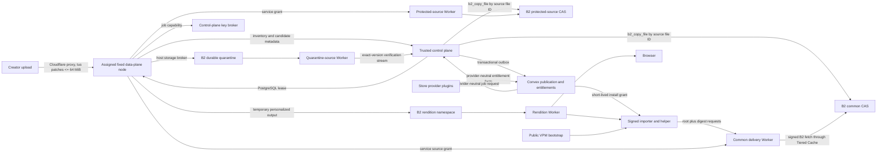

# Package storage, delivery, and forensic coupling architecture

Date: 2026-07-22
Status: target architecture
Implementation plan: [package-storage-delivery-implementation-plan.md](./package-storage-delivery-implementation-plan.md)
Progress record: [package-storage-delivery-progress.md](./package-storage-delivery-progress.md)
Research basis: [package-storage-research-ledger.md](./package-storage-research-ledger.md)

## 1. Executive decision

Build one file-oriented, content-addressed package system with these boundaries:

- Creator uploads go through a Cloudflare-proxied tus hostname to one assigned fixed data-plane node. Every `PATCH` stays below the zone's request-body limit, and no Worker buffers upload bodies.
- Archives are quarantined, scanned, normalized into a logical file tree, and chunked per file. The outer ZIP, gzip, Unitypackage, or proprietary container is never the deduplication unit.
- Small identical files deduplicate exactly regardless of path or archive order. Large files use content-defined chunking so local changes reuse unchanged byte ranges.
- Backblaze B2 is the only durable bulk-byte store. Launch uses one B2 account and region. Cross-region replication is designed in but disabled at launch by product decision.
- The existing fixed node is the trusted control plane. It owns PostgreSQL workflow state, publication, signing, the key broker, and the launch verifier/promoter role. It does not parse creator archives or run native media codecs. Verification capacity is a separately leaseable role so it can later move to another fixed trusted node without changing the protocol.
- One preapproved fixed-price data-node SKU, `D_data`, is the launch data plane.
- Phase 0 evaluates the Hetzner CX43 European SKU as the current candidate.
- The SKU provides eight shared vCPUs, 16 GB RAM, 160 GB SSD, and at least 20 TB included traffic.
- Its current monthly cap is $18.49 before tax, without IPv4.
- The approval covers usable disk, port, IOPS, fair-use terms, add-ons, taxes, renewal price, and availability.
- The node owns tus, staging, scanning, normalization, chunk production, protected materialization, and rendition construction.
- Its host broker holds only prefix-restricted quarantine-write and rendition-write keys.
- Sandboxed code receives no B2 key.
- PostgreSQL provides durable jobs, leases, backpressure, retries, the transactional outbox, and GC journals. Do not add a queue product at launch.
- Separate Cloudflare Workers authenticate common/metadata reads, quarantine reads, protected-source reads, and renditions. They share one Workers Paid account but never share write credentials.
- The primary edge design uses one billed Worker request per requested chunk and ordinary `fetch()` subrequests through Cloudflare's standard CDN and Tiered Cache. This must pass the real-account security and billing gate before format freeze.
- The first-party importer reconstructs verified content and owns transactional project installation. VCC installs only a small public bootstrap package that depends on the importer.
- Protected content is materialized server-side with subject-and-release-scoped derived material released for one authorized job. The client receives personalized bytes and a signed receipt, never a master key or derivation key.
- When fixed capacity is exhausted, accept no unbounded work. Queue with visible backpressure. Capacity grows manually in predictable fixed-node increments when sustained measurements cross the scaling gate.

This replaces the previous whole-tree streaming design. Deterministic gzip tar reordering needs a bounded spool. One serialized tree also cannot guarantee reuse after path or neighbor changes.

## 2. Goals, decisions, and non-goals

### Goals

1. Deduplicate repeated files and repeated byte ranges across product versions.
2. Keep permanent storage limited to reachable canonical chunks, compact metadata, and recovery data.
3. Keep buyer-specific materializations temporary.
4. Keep the monthly bill mostly fixed and understandable.
5. Preserve exact entitlement isolation even when physical chunks are shared.
6. Support importer, VCC bootstrap, and browser download without maintaining three storage formats.
7. Preserve end-to-end OpenTelemetry and HyperDX correlation without logging every chunk as a full trace.
8. Fail closed when scanning, verification, entitlement, signing, or protected materialization fails.

### Launch decisions

- Backpressure is required. Automatic unbounded scaling is prohibited.
- One data-plane node is sufficient at launch. Ingest and materialization failover are not launch requirements.
- Cross-region B2 replication is not a launch requirement. The accepted residual risk is documented under durability.
- One product version may contain at most 5 GiB of uploaded compressed bytes at launch.
- The launch data node runs one large job at a time. Small overlays may run concurrently only after resource tests prove the combination safe.
- Common unprotected bytes use a global deduplication domain. Protected source bytes use a creator-scoped deduplication domain.
- Launch accepts that a full data-node host compromise can substitute a self-consistent normalized tree or scan result that the control plane may validly sign. Parser/codec sandboxing reduces the chance of host compromise but does not remove this trust. Phase 0 requires explicit product/security acceptance. Otherwise an independently trusted canonicalizer/scanner becomes a launch requirement and must be included in fixed capacity.

### Non-goals at launch

- No R2, Cache Reserve, Durable Objects, KV delivery sessions, Cloudflare Queues, Workflows, Cloudflare Containers, or second managed database.
- No custom pack format or locator database until loose-chunk delivery fails a measured SLO.
- No per-chunk PostgreSQL, Convex, Redis, provider, or entitlement call.
- No client-held B2 credentials, shared HMAC verification secret, coupling master, or seed-derivation key.
- No promise of sub-file semantic deduplication for proprietary formats without a supported parser. `.spp` is opaque at launch.
- No claim that a single-region B2 account survives regional or account-level loss.

## 3. Target system

The product journey is:

1. A creator creates a package, connects stores through plugins, and explicitly binds each applicable listing.
2. The creator defines optional editions for products or store tiers.
3. The creator reserves capacity and uploads one package edition.
4. The system quarantines, scans, normalizes, deduplicates, verifies, signs, and publishes the release.
5. A buyer adds the small public VPM bootstrap through VCC.
6. The importer verifies the buyer through the provider-neutral entitlement system.
7. The control plane selects one entitled edition and issues short-lived client-bound grants.
8. The helper downloads missing common chunks and any temporary protected overlay.
9. The helper applies the verified release through one Unity project transaction.



## 4. Placement, trust, and failure behavior

| Component                | Responsibilities                                                                                 | Credentials                                                                                                                                 | Launch failure behavior                                                                     |
| ------------------------ | ------------------------------------------------------------------------------------------------ | ------------------------------------------------------------------------------------------------------------------------------------------- | ------------------------------------------------------------------------------------------- |
| Existing control node    | PostgreSQL, jobs, publication, verification, brokers, GC, and cost admission                     | Catalog roles and narrow reconcile keys. Promotion keys without delete. Separate signing keys, coupling master, and Infisical identity.     | Existing common downloads continue while grants remain valid. New control-plane work waits. |
| Fixed data-plane node    | tus, host broker, parsing, scanning, normalization, CDC, codecs, overlays, and ZIP renditions    | Narrow quarantine-write and rendition-write keys in the host broker. Short-lived capabilities. No master or canonical delete.               | New work queues. Pre-quarantine loss can require upload restart. No launch failover.        |
| Common delivery Worker   | Buyer and service grant checks. Delivery-binding checks. Cached common and metadata reads.       | Separate read-only common and metadata keys. Public capability-verification keys.                                                           | Common and metadata delivery fail closed.                                                   |
| Quarantine-source Worker | Service-only exact-version candidate reads. Caching disabled.                                    | Read-only quarantine key. Public service-capability keys.                                                                                   | Verification and resumed work retry through the durable queue.                              |
| Protected-source Worker  | Service-grant, delivery-binding, and protected-source checks.                                    | Separate read-only protected and metadata keys. Public service-capability keys.                                                             | Protected jobs retry through the durable queue.                                             |
| Rendition Worker         | Private buyer range delivery, service-only exact-version verification reads, and TTL enforcement | Rendition-prefix read-only B2 key                                                                                                           | Client retries or requests rendition recreation.                                            |
| B2 janitor               | Native journaled exact-file-version deletion                                                     | Separate `deleteFiles`-only keys for explicitly named quarantine, canonical, metadata, and rendition buckets/prefixes. No governance bypass | Storage grows but live data remains available.                                              |
| B2 configuration monitor | Bucket-default Object Lock retention drift checks                                                | Read-only `listBuckets` plus `readBucketRetentions`. No file read/write/list/delete or bucket mutation                                      | Publication admission stops if required retention cannot be verified.                       |
| Convex                   | Products, entitlements, publication projection, grant issuance, attribution record               | No B2 or coupling master returned to clients                                                                                                | New grants stop. Cached bytes remain inaccessible without a valid grant.                    |
| Importer/helper          | Auth refresh, local cache, reconstruction, receipt verification, project transaction             | Buyer session and short-lived grants only                                                                                                   | Project remains unchanged until a verified transaction commits.                             |

The data node is a breach-contained ephemeral processing domain. It is not an adversarially secure enclave. A host compromise can expose the active job's plaintext and derived material. The host can also submit malicious normalized trees, scan results, or renditions. The host cannot expose the coupling master, sign metadata, commit publication state, or delete canonical objects. Exact-version verification proves byte identity and reconstruction. It does not prove that a compromised host scanned or canonicalized honestly. A stronger defense requires an independently trusted scanner and canonicalizer. An attested processing boundary is another possible defense. Archive parsers and native codecs run in separate rootless sandboxes. Each sandbox uses a separate OS identity and a read-only runtime image. Each sandbox has cgroup limits and seccomp, AppArmor, or equivalent policy. A sandbox has no outbound network except its bounded local brokers. Disable core dumps. Do not give a sandbox access to another job's workspace.

The control node is not a client delivery proxy. Its launch verifier reads each new encoded chunk once. The verifier decompresses and hashes the chunk before promotion. Chunks with a verified exact canonical version skip this work. Verification is a resource-tokened worker role. The role has its own queue depth and scale trigger. New data nodes cannot silently move the bottleneck into the control host.

Promotion uses B2 Native API `b2_copy_file` with the exact quarantined `sourceFileId`. This removes the verify-then-copy-by-name race. It supports cross-bucket copies inside one account. It returns the exact destination `fileId`. It is a free Class C transaction at the current price. See [b2_copy_file](https://www.backblaze.com/apidocs/b2-copy-file). See [b2_delete_file_version](https://www.backblaze.com/apidocs/b2-delete-file-version). See [B2 transaction pricing](https://www.backblaze.com/cloud-storage/transaction-pricing).

## 5. Storage model v2

### 5.1 Normalize logical files before deduplication

Every supported input becomes a canonical logical file tree before chunking:

- `.unitypackage`: Parse the gzip tar. Validate each GUID directory. Map `pathname`, `asset`, and `asset.meta` to the final Unity project path. Discard transport-only metadata.
- `.zip` and ordinary tar formats: validate and normalize entries through libarchive.
- Directory uploads: apply the same path and metadata policy as archives.
- `.spp` and unsupported proprietary containers: retain as one opaque logical file, then apply whole-file identity and CDC to its bytes. Do not claim semantic internal deduplication.

A bounded staging tree or spool is mandatory. It permits deterministic path ordering and collision checks without pretending a sequential gzip stream can be reordered in place. The staging tree is ephemeral and is deleted only after publication or terminal failure cleanup.

Reject before chunking:

- absolute, drive-qualified, parent-traversing, NUL-containing, or reserved paths.
- symlinks, hardlinks, devices, FIFOs, sockets, and sparse-file tricks unless an explicit future package policy supports them.
- duplicate normalized paths.
- Unicode normalization or case-folding collisions.
- excessive entry count, path depth, normalized path length, per-file size, expanded bytes, expansion ratio, CPU time, or wall time.
- encrypted archives that the service cannot inspect.
- malformed Unitypackage GUID groups or entries outside the permitted project layout.

Resource limits are centralized policy, not literals spread across parsers. Launch defaults are:

| Limit                                  |      Launch value |
| -------------------------------------- | ----------------: |
| Uploaded compressed bytes              |             5 GiB |
| Expanded logical bytes                 |            20 GiB |
| Logical entries                        |           250,000 |
| Normalized path bytes                  | 1,024 UTF-8 bytes |
| Path depth                             |       64 segments |
| Single logical file                    |             5 GiB |
| Distinct logical chunks                |           100,000 |
| Encoded chunk object                   |             2 MiB |
| All release metadata before signatures |           128 MiB |
| Concurrent large jobs per data node    |                 1 |

Upload creation reserves compressed bytes plus the calculated processing envelope. Admission fails before the client uploads if aggregate disk reservations would violate the node's OS/runtime/log allowance, active-job reservations, or emergency headroom.

### 5.2 File-oriented chunk recipes

The package root is not one serialized tar stream. Each logical file has an independent identity and recipe:

1. Compute a domain-separated whole-file digest over its bytes.
2. For files below the minimum CDC size, store one content-addressed chunk.
3. For larger files, run the pinned desync CDC and zstd implementation over that file only.
4. Store each ordered chunk's logical digest, logical length, encoded length, and encoded-object digest in a sharded file table.
5. Compute the logical tree root from normalized path, classification, logical metadata, and file digest.

This permits storage reuse after a file moves to another path. Neighboring archive files do not prevent reuse.

Use desync v1.0.3 as the initial CDC and native compressed-chunk engine. Pin the source commit and each distributed binary digest. Do not use desync's direct S3 store as the canonical publisher. Its v1.0.3 existence check requires reads. Its store path performs an unconditional `PutObject`. The service owns promotion and GC semantics.

The starting CDC profile is `64:256:1024 KiB` minimum, average, and maximum. Phase 0 must test it against the production corpus. Compare 128, 256, 512, and 1,024 KiB average profiles. Measure monthly cost, cold-install p95, update bytes, object count, and deduplication ratio. Each release descriptor identifies the selected profile. Do not change the profile silently.

Longtail remains the required comparison candidate. It supports incremental asset trees, chunk aggregation, and local caches. Adopt it only if the same-corpus gate beats the file-oriented desync design. It must also pass native build, security, and platform support requirements. [Longtail](https://github.com/DanEngelbrecht/longtail)

### 5.3 Deduplication domains

- A versioned product protection-policy snapshot classifies normalized paths after archive parsing. Classification may use creator-selected path rules and supported file-type capabilities, but never untrusted archive metadata alone.
- A path marked protected must have a supported, verified materializer plugin or publication fails. Changing classification creates a new release. It never mutates an existing root.
- Common unprotected content uses `common:global:v2` so identical public or buyer-safe bytes reuse storage across creators.
- Protected source content uses `protected:creator:<creatorId>:v2` so a creator gets cross-product and cross-version reuse without coupling unwatermarked source bytes across tenants.
- Temporary personalized outputs never enter a deduplication domain.
- Domain identity is part of every object key and digest purpose string. Moving content between domains is a verified copy, never an alias.

### 5.4 B2 namespaces

Use one B2 account with five private buckets because credentials, Object Lock, cache policy, and lifecycle differ. All object names begin with `v2/`. Bucket names are deployment configuration and never enter logical release identity.

| Bucket role   | Object Lock | Long-lived credential boundary                                                                                                                                                                                              |
| ------------- | ----------- | --------------------------------------------------------------------------------------------------------------------------------------------------------------------------------------------------------------------------- |
| Quarantine    | No          | Data-host broker has `writeFiles` on this bucket and `v2/`. Quarantine-source Worker has `readFiles`. Control reconciler has `listFiles` plus `readFiles`. Quarantine janitor has `deleteFiles`.                            |
| Common CAS    | Yes         | Common Worker has `readFiles` on `v2/common/`. Common promoter has `readFiles`, `writeFiles`, `listFiles`, and `readFileRetentions` on the same prefix across the quarantine and common buckets.                            |
| Protected CAS | Yes         | Protected Worker has `readFiles` on `v2/protected/`. Protected promoter has `readFiles`, `writeFiles`, `listFiles`, and `readFileRetentions` on the same prefix across the quarantine and protected buckets.                |
| Metadata      | Yes         | Common and protected Workers have metadata `readFiles`. Metadata promoter has `readFiles`, `writeFiles`, `listFiles`, and `readFileRetentions` on `v2/metadata/` across quarantine and metadata buckets.                    |
| Renditions    | No          | Data-host broker has `writeFiles` and may cancel only the active job's fenced multipart upload. Rendition Worker has `readFiles`. Control reconciler has `listFiles` plus `readFiles`. Rendition janitor has `deleteFiles`. |

The three promoter keys are trusted control-plane credentials. They cannot delete files or administer buckets and keys. They cannot change retention or bypass governance. Each promoter reads inherited retention on every exact destination version. Publication fails when governance mode or the minimum retention time is absent. A separate configuration monitor checks each bucket default. The monitor has no object-data capability. Quarantine and destination prefixes match deliberately. This keeps B2 account-wide prefix restrictions useful for cross-bucket copies. Reconcile keys cannot write or delete. Janitor keys cannot read, list, write, cancel multipart uploads, or bypass governance. The lease-fenced host broker owns active multipart cancellation. A longer-delay lifecycle rule removes orphaned unfinished uploads. Phase 0 must prove this matrix with a real B2 account. Stop the design if B2 cannot express one row. Do not broaden a key.

```text
quarantine bucket: v2/raw/<jobId>/<uploadDigest>
quarantine bucket: v2/common/<jobId>/<encodingProfile>/<logicalDigest>
quarantine bucket: v2/protected/<creatorDomain>/<jobId>/<encodingProfile>/<logicalDigest>
quarantine bucket: v2/metadata/<jobId>/<metadataDigest>
common bucket:     v2/common/<encodingProfile>/<logicalDigest>
protected bucket:  v2/protected/<creatorDomain>/<encodingProfile>/<logicalDigest>
metadata bucket:   v2/metadata/releases/<releaseRoot>
metadata bucket:   v2/metadata/file-tables/<shardDigest>
metadata bucket:   v2/metadata/membership/<shardDigest>
metadata bucket:   v2/metadata/delivery-bindings/<bindingRoot>/index
metadata bucket:   v2/metadata/delivery-binding-shards/<shardDigest>
rendition bucket:  v2/shared/<renditionKey>
rendition bucket:  v2/personalized/<renditionKey>
```

Object names contain no buyer identity, provider identifier, email, product title, or other sensitive metadata. Canonical names are immutable identities, but B2 can retain multiple versions with one name. Every write therefore records the returned native file ID. A conflicting new version is an integrity incident, not normal overwrite behavior. Reads by name are not an integrity boundary. [B2 file versions](https://www.backblaze.com/docs/cloud-storage-file-versions)

### 5.5 Signed metadata contracts

Hashed metadata uses deterministic CBOR from RFC 8949 and SHA-256. Separate COSE Sign1 envelopes carry signatures. Each hash input starts with an ASCII purpose tag. Each following field starts with its unsigned 64-bit big-endian byte length. Structured fields use deterministic CBOR before framing. The versioned schema defines map keys and integer ranges. It also defines Unicode normalization, path order, and absent values. Golden vectors must agree in each implementation before format freeze. Use [RFC 8949 deterministic encoding](https://www.rfc-editor.org/rfc/rfc8949.html#name-deterministically-encoded-cbo). Use [COSE Sign1](https://www.rfc-editor.org/rfc/rfc9052.html). Do not create a custom signing envelope.

The root formulas are explicit:

```text
logical_chunk_digest = H("yucp:chunk:v2", logical_bytes)
encoded_chunk_digest = SHA-256(encoded_chunk_object)
whole_file_digest    = H("yucp:file:v2", logical_file_bytes)
file_leaf            = H("yucp:file-leaf:v2", normalized_path, classification,
                         canonical_metadata, whole_file_digest)
recipe_digest        = H("yucp:recipe:v2", encoding_profile, ordered_chunk_recipe)
logical_tree_root    = Merkle("yucp:tree:v2", file_leaf values sorted by normalized UTF-8 path)
file_table_root      = Merkle("yucp:file-table:v2", shard digests sorted by declared path range)
membership_root      = Merkle("yucp:membership:v2", shard digests sorted by digest-prefix range)
delivery_binding_root = H("yucp:delivery-binding:v2", deterministic_cbor(unsigned_binding_index))
release_root         = H("yucp:release:v2", deterministic_cbor(unsigned_release_payload))
```

Merkle leaf and internal-node tags differ. The schema fixes empty-root behavior, odd-node handling, range ordering, and proof encoding. A signature never appears inside the payload whose digest it signs, so roots are not circular.

`ReleaseDescriptorV2` is compact, immutable, content-addressed, signed, and capped at 256 KiB encoded. It contains:

- format, encoding profile, canonicalizer, and archive-writer versions.
- product version identifier and provider-neutral entitlement audience.
- common root and protected-source root.
- file-table index root and membership index root.
- active-content inventory digest and policy version for Editor scripts, assemblies, executables, and native plugins.
- logical, common, protected, encoded, and file-count totals.
- all index commitments needed to locate and prove each shard.
- publication timestamp and schema epoch. The separate COSE envelope carries algorithm, signing key ID, payload digest, and signature.

`FileTableShardV2` is content-addressed and limited to 4 MiB encoded. Each entry contains path, classification, size, digest, and ordered chunk recipe. `FileTableIndexV2` maps normalized path ranges to exact shard digests. The release descriptor identifies the signed index root. It does not embed an unbounded file list.

`MembershipShardV2` contains sorted domain, profile, digest, and length tuples. It is logical region-independent release metadata. Each shard includes a proof to the signed membership root. Limit each shard to 1 MiB and 4,096 entries. A bounded membership index maps digest prefixes to shard digests.

`DeliveryBindingV2` is a separate signed projection for one region and storage epoch. It binds one release and membership root to exact storage locations. Each location includes the bucket role, key, version, digest, length, and cache epoch. Name each shard with its content digest. Limit each shard to 1 MiB and 4,096 entries. Upload and verify each exact shard version. Limit the signed index to 256 KiB. The index maps digest prefixes and metadata digests to exact shard locations. The index does not contain its own location. Therefore, its binding root can identify the index without a circular hash. `InstallGrantV2` carries exact bootstrap locations and digests. It also carries the binding root and storage region. PostgreSQL keeps one active binding pointer for each release and region. The grant signer replaces or disables this pointer in an atomic audited operation. A replica can publish a new binding without changing the logical release root.

Fetch release descriptors, indexes, and shards through an authenticated metadata route. The signed delivery-binding index carries exact metadata file identifiers. A grant carries the initial bootstrap locations. The gateway never infers a shard name without a signed index.

Produce `MaterializationReceiptV2` for each personalized result. Its unsigned payload contains release and protected-source roots. It also contains the subject pseudonym, grant, job, and lease generation. Add the exact verified rendition version when applicable. Add algorithm, codec, and key versions. Add output hashes, the personalized tree root, and creation time. A separate COSE envelope carries the signature. Do not put personalized hashes in the immutable release descriptor. Apply explicit PostgreSQL and Convex retention policies to receipts and attribution records. Do not put these records in the bulk CAS namespace.

Sort materialized files by normalized UTF-8 path bytes.

```text
output_tree_root = H(
  "yucp:output-tree:v2",
  for each file: normalized_path_utf8,
  output_sha256,
  output_length_uint64_be
)
```

The exact rendition record contains its storage role, bucket, key, provider version, file identifier, digest, and length.

Importer/helper releases and their metadata use The Update Framework. TUF supplies offline root trust, expiry, threshold signing, consistent snapshots, rollback/freeze protection, delegations, and key rotation. Use `go-tuf/v2` in the native helper rather than inventing an update trust protocol. [TUF](https://theupdateframework.io/) and [go-tuf/v2](https://github.com/theupdateframework/go-tuf)

## 6. Ingest and publication

### 6.1 Durable state machine

Use PostgreSQL as the authoritative workflow system:

```text
CREATED
  -> ASSIGNED
  -> UPLOADING
  -> UPLOADED_LOCAL
  -> RAW_DURABILITY_PENDING
  -> QUARANTINED
  -> SCANNING
  -> NORMALIZING
  -> CHUNKING
  -> PROMOTION_PENDING
  -> VERIFYING
  -> PUBLICATION_PENDING
  -> PUBLISHED
```

Each state records its attempt, assigned node, lease owner, and lease generation. It also records lease expiry, heartbeat, retry time, idempotency key, and last error. Terminal transitions are `FAILED`, `REJECTED`, and `CANCELLED`. Workers claim portable jobs with `FOR UPDATE SKIP LOCKED`. Each claim increments the fence. Workers renew leases and use exponential backoff with jitter. Each mutation compares job, state, owner, and lease generation. Carry the fence through each external capability and output commit. A stale worker can finish a short read already in progress. It cannot create a write intent or receive key material. It cannot sign a receipt or commit state. Put terminal failures in a reviewable dead-letter state. Do not use an infinite retry loop.

Start each B2 write with a committed `StorageWriteIntentV2`. This includes uploads, multipart completion, and native copies. Record the intent, job, lease generation, bucket role, exact key, digest, length, operation, expiry, and state. Allow only the internal intent and fence in B2 metadata. Attach the returned exact version with a fenced compare-and-swap. A lost response starts control-owned reconciliation. The reconciler inspects only the deterministic key. It adopts one exact version that matches all intent fields. Do not retry an uncertain write before reconciliation finishes. Pin extra versions as orphans. Delete them only after Object Lock and the two-generation janitor permit deletion. Writers do not need delete capability for this recovery path.

Queue lanes use weighted fair scheduling with aging, not strict priority that can starve publication or maintenance:

1. Interactive protected overlays.
2. Creator publication.
3. Browser ZIP rendition.
4. Scrubbing, GC, and maintenance.

The scheduler uses weighted CPU, RAM, disk, network, codec, and trusted-verifier tokens, not only job counts. A reserved maintenance window and aging floor guarantee progress for low-priority work. Large file-oriented jobs checkpoint between files. Resource tests must prove that cgroup reservations let a small overlay run beside a single-large-file job. If they do not, the two-minute overlay objective is not published until a second fixed capacity node or a genuinely resumable chunker provides it.

### 6.2 Upload and quarantine

Keep `@tus/server`, `@tus/file-store`, and `tus-js-client`. Upload reservation selects one node and returns a short-lived, creator-bound upload token plus a node-specific tus URL. That session remains pinned to the node for its lifetime. A future second node receives only new sessions unless storage has already reached durable quarantine.

Before token issue, PostgreSQL reserves creator and global capacity in one transaction. Reserve queued jobs, compressed bytes, expanded bytes, and quarantine byte-hours. Reserve worst-case canonical bytes, metadata retention, verification operations, and verification bytes. Check the reservation against the application budget and B2 recovery headroom. Release unused capacity after deduplication and final size calculation. Reconcile byte-hours until exact quarantine deletion. Stop admission before a delayed quarantined job exceeds its reservation. Then renew the budget or cancel the job. Apply policy-compliant exact-version cleanup after cancellation.

Expose each tus origin through Cloudflare proxying, preferably a Tunnel, without an upload Worker. If a public origin is unavoidable, restrict it to Cloudflare traffic and authenticated origin pulls. Start `tus-js-client` at 16 MiB. Limit each `PATCH` to 64 MiB. Tune this value from regional and slow-link tests. Retry with a smaller value after a proxy timeout. The origin validates the signed reservation on each tus method. It enforces length, offset, CORS, content type, metadata, connection, and creator limits. Do not trust Cloudflare alone for authentication. [Cloudflare request-body limits](https://developers.cloudflare.com/workers/platform/limits/#request-limits) and [Cloudflare connection limits](https://developers.cloudflare.com/fundamentals/reference/connection-limits/) are launch gates.

The Node tus server does not implement the tus Checksum extension. Thus, resumable offsets are not an integrity boundary.

When upload completes, move the local file into its job-owned workspace atomically. Compute the complete server-side upload digest. Then enter `UPLOADED_LOCAL`.

In one fenced transaction, enter `RAW_DURABILITY_PENDING`. Commit the raw `StorageWriteIntentV2` in that transaction. Then let the host storage broker stream the file.

Attach the returned exact file ID and digest to the intent. Then enter `QUARANTINED`.

If the upload result is uncertain, reconcile the intent before a retry. Use the deterministic key and intent metadata for reconciliation. See the [tus protocol](https://tus.io/protocols/resumable-upload) and [tus Node server](https://github.com/tus/tus-node-server).

The assigned data node then:

1. Run libarchive validation and inventory under resource limits.
2. Scan the raw container and expanded logical files. Use long-lived `clamd` through a local socket and YARA-X policy rules. Update and verify scanner definitions separately. Give scanner sandboxes no Internet access.
3. Record scanner engine, signature, and rule versions.
4. Apply separate policy to scripts, executables, libraries, plugins, and other active content. Sign their inventory into the release. Antivirus does not make active content trusted.
5. Fail closed after a skipped, timed-out, crashed, or excessive scan.

Use [libarchive](https://github.com/libarchive/libarchive) for archive input. Use [ClamAV](https://docs.clamav.net/manual/Usage/Scanning.html) and [YARA-X](https://github.com/VirusTotal/yara-x) for scanning.

Before durable quarantine, loss of the assigned node or its disk may require the creator to restart the upload. This is accepted because launch has no ingest failover. After `QUARANTINED`, raw input and all checkpoints needed to restart are in B2/PostgreSQL, so any compatible node may lease processing. Normal same-node processing reuses the verified local raw file and avoids downloading it again.

### 6.3 Quarantine upload and trusted promotion

The sandboxed chunk producer receives a job-scoped and lease-fenced IPC capability. It submits bounded candidate metadata to the host storage broker. The broker requests one control-plane decision for each digest. `REUSE` identifies one verified exact canonical version. `UPLOAD` includes one committed quarantine write intent. Do not upload or reread an already verified chunk. Restrict one fixed `writeFiles` key to quarantine and `v2/`. The broker validates the job, fence, and key mapping. It supplies exact object names. It attaches the returned B2 file identifier to the intent. No service creates B2 application keys dynamically. The sandbox cannot list, read, overwrite, or delete CAS objects. Final exact-version reconstruction is the publication integrity boundary.

For each candidate chunk, the trusted promoter:

1. Acquire a digest-scoped PostgreSQL advisory lock. Read the catalog again for the declared domain, profile, and logical digest.
2. If a cataloged verified exact canonical version exists, records reuse and releases the lock. If an `UNVERIFIED` version belongs to a live promotion, it waits or helps that promotion instead of creating another version. A stale promotion must be claimed and reconciled explicitly. The newest version by name is irrelevant.
3. For a new digest, require the cataloged exact quarantine file identifier. Require a matching job, fence, and write intent. Read a capped stream through the service-only quarantine Worker.
4. Validate framing, encoded length, and encoded-object digest. Decompress the chunk. Verify logical digest and logical length.
5. Commit the destination `StorageWriteIntentV2`. Call native `b2_copy_file` with the verified source identifier and derived destination name.
6. Use metadata replacement with a fixed allowlist. Give common objects a fixed internal cache policy. Give protected and metadata objects a fixed private policy. Never copy creator-controlled response headers.
7. Attach the returned version, digest, lengths, domain, job, and `UNVERIFIED` state to the intent. Keep a promotion pin.
8. Perform an exact `HeadObject` for the returned destination version. Validate version, length, metadata, governance mode, and minimum retention time. Release the digest lock. Keep the version pinned until complete reconstruction marks it `VERIFIED`.

The promoter has quarantine read plus destination read/write but no delete capability. The janitor uses native `b2_delete_file_version` with `deleteFiles` only and cannot publish. Governance bypass is an offline break-glass credential, never a service secret. No service receives a B2 master key.

### 6.4 Verification and atomic publication

Before public visibility:

1. Reconstruct each file from cataloged exact canonical versions. Use a hash sink or bounded verification workspace. Read promoted versions through the matching service-only Worker. Verify encoded and logical digests and lengths.
2. Mark each promoted version `VERIFIED`. Verify each file, tree, file-table, membership, and release root. No other release can reuse an `UNVERIFIED` version.
3. Build and sign the deterministic descriptor, indexes, and shards. Stage and promote each object through its own write intent. Read each exact version again. Verify its digest, signature, and retention. Keep its exact location pinned.
4. Build and sign delivery-binding shards that reference the verified exact canonical chunk versions and exact logical-metadata versions. Stage, promote, exact-version verify, and pin every shard.
5. Build and sign the delivery-binding index that commits every binding shard and logical-metadata locator/digest. Stage, promote, exact-version verify, and pin the index. The index does not contain its own locator. Its exact bootstrap locator, digest, and binding root are recorded separately.
6. Verify a sample through the same Cloudflare HTTP path used by the importer against the pending exact binding.
7. Store roots, exact locations, pins, and `PUBLICATION_PENDING` in one fenced transaction. Append the complete catalog outbox record.
8. An idempotent outbox publisher writes the immutable publication projection and exact bootstrap locators to Convex.
9. Only the matching Convex publication acknowledgement activates the release/binding pointer and transitions PostgreSQL to `PUBLISHED`. Grant issuance reads only that active pointer and never discovers metadata by newest object name.

Convex owns public visibility. PostgreSQL owns workflow truth. Reconciliation repeatedly repairs either side of a crash between those operations. Every promoted object remains pinned to its active promotion record until the publication acknowledgement commits, so concurrent GC cannot collect a not-yet-visible release.

Keep successful quarantine versions for 24 hours after verified publication. This includes raw, common, protected, and metadata candidates. Then delete each exact version through the quarantine janitor. Keep other quarantine versions for seven days. A security hold, legal hold, or creator deletion policy can change this period. Reservations include queued byte-hours until exact deletion. Lifecycle rules are a longer-delay backstop. They are not the exact deletion mechanism.

## 7. Entitlements, grants, and revocation

### 7.1 Creator store connection and buyer verification

Provider-specific OAuth, API semantics, webhooks, manual-license checks, and response parsing remain inside provider plugins. The shared system exposes only versioned hooks such as `connectCreator`, `listCreatorProducts`, `mapProduct`, `verifyBuyer`, `consumeWebhook`, `reconcileEntitlements`, and `health`. Storage, gateway, importer, and materializer code never branch on Gumroad, Jinxxy, Discord, or another provider.

The end-to-end commerce flow is:

1. The creator connects a store account through its plugin.
2. The creator explicitly binds each applicable listing to one owned package.
3. The creator maps optional editions to bound listings or active tiers.
4. Store the minimum credential set in an authenticated-encryption envelope.
5. Derive each credential key with a provider-specific and purpose-specific HKDF context.
6. Decrypt credentials only inside the provider call.
7. Mark an expired connection as degraded and emit a redacted audit event.
8. Webhooks and reconciliation create provider-neutral entitlement snapshots.
9. The buyer links or verifies one current bound storefront identity.
10. The control plane resolves the highest-priority matching active edition.
11. Refund, dispute, revocation, or expiry denies new grants immediately.
12. Publication remains immutable when bindings or edition mappings change.

Explicit `package_catalog_bindings` rows are the only authority for cross-store package grouping.

Display names, slugs, product identifiers, and release history never imply a package association.

A catalog product has at most one active package binding.

The creator must confirm each bind or unbind operation.

An unbind must never widen edition access.

Archive an affected edition when the operation removes its final tier constraint.

An entitlement without a catalog identifier uses the unique provider and product identifier pair.

Ambiguous or cross-provider entitlement matches fail closed.

Catalog deletion is blocked while an active package binding or edition dependency exists.

All provider requests cite and contract-test the provider's documented endpoint and response shape. Webhook delivery is not treated as complete truth. Reconciliation repairs missed, duplicated, reordered, and delayed events. Connect, disconnect, credential expiry, mapping change, verification, refund, dispute, and manual remediation are audited without credential or buyer PII leakage.

The subject pseudonym is pairwise and domain-separated per creator, not a raw provider/user ID or a global buyer correlation key. The encrypted attribution record is the only authorized mapping back to the account identity. Object names, cache keys, traces, and ordinary logs never contain that mapping.

### 7.2 Capability types and signing domains

Use separate Ed25519 key domains and `kid` allowlists for these objects:

- release metadata
- delivery bindings
- install grants
- internal source-read grants
- materialization capabilities
- receipts
- TUF online metadata

Keep TUF root keys offline. Convex evaluates entitlement and asks the control-plane signing RPC to mint a claim. Convex does not receive a general signing key.

Make the RPC accept only a typed provider-neutral claim. Apply budget admission. Record `grant_jti` before signing.

Worker deployments carry an explicit accepted-key set. Normal rotation adds the new verifier before minting with it and removes the old verifier only after its longest grant expires. Emergency `kid` rejection is a fail-closed Worker configuration deployment with an audited runbook. It may invalidate unrelated active grants signed by that key.

Capability types are not interchangeable:

- `InstallGrantV2`: Identify the buyer, release, membership, region, subject, and session. Add exact descriptor and binding locations with digests. Add allowed operations, declared limits, token times, identifiers, and client-key thumbprint.
- `SourceReadGrantV2`: Identify the service, job, lease, release, root, and domain. Add the allowed object set or exact file identifier. Add methods, expiry, token identifier, and proof-of-possession key. Each Worker accepts only its own domain and audience.
- `MaterializationJobCapabilityV2`: one exact queued job and lease generation, subject, release/protected roots, plugin/algorithm/output format, one-use nonce, expiry, `grant_jti`, and proof-of-possession key. The key broker checks the current fence and atomically consumes it in PostgreSQL.
- `RenditionGrantV2`: buyer/session, stable opaque `abuse_session_id`, exact rendition key, B2 file ID/version, digest, length, byte/range policy, `grant_jti`, short expiry, and client-key thumbprint.

Use strict allowlists for JWS type, algorithm, issuer, audience, key, lifetime, and clock skew. Use the RFC 9449 DPoP profile for buyer and service requests. Include method, canonical URL, issue time, and a fresh proof identifier. Set `ath` to the hash of the exact grant token. Sign with the key from the grant thumbprint. Distinguish stable grant identifiers from per-proof identifiers. Test token substitution, proof reuse, and proof identifier rotation. A copied grant is not useful without the client key. An entitled malicious client can still spend its own grant. [RFC 9449](https://www.rfc-editor.org/rfc/rfc9449)

### 7.3 Renewal, revocation, replay, and budget admission

Launch grants live for at most 15 minutes and are renewable. Renewal rechecks entitlement, evidence TTL, signing-key status, installation-session budget, and global admission. Revocation stops renewal, but an already minted grant remains usable until its `exp` unless its signing key is emergency-rejected. The normal revocation bound is therefore 15 minutes. The architecture does not falsely claim instantaneous revocation without online state.

Reserve expected missing chunks and bytes when the control plane creates an installation session. Limit session creation, churn, and concurrency by buyer, creator, and account. Each renewal reuses the same `abuse_session_id`. A new session consumes a new admitted budget and cooldown. Key the local buyer limit by subject and abuse session. Key internal limits by service, job, and lease generation. Do not key limits by renewable grants or rotatable proof identifiers. Rate limits are abuse guards. They are not billing truth or exact global accounting. [Workers Rate Limiting binding](https://developers.cloudflare.com/workers/runtime-apis/bindings/rate-limit/)

A stateless edge cannot enforce cumulative limits across all Cloudflare locations. Therefore, the monthly delivery ceiling is a soft forecast and admission ceiling. It is not a hard traffic stop. Record the residual denial-of-wallet risk. Phase 0 models the maximum spend for one grant lifetime. It tests theft, replay, multi-region replay, and malicious-client traffic. Active installs can finish after a soft monthly budget closes. New grants stop. Add priced exact edge state when the product requires a hard bound. Use the same action when the residual risk is unacceptable.

## 8. Cloudflare delivery

### 8.1 Separate deployments

Deploy four Workers under the same Workers Paid account:

1. `common-delivery`: buyer and service routes, separate common-CAS and metadata B2 read-only keys.
2. `quarantine-source-delivery`: service-only raw/candidate route, quarantine B2 read-only key, cache disabled.
3. `protected-source-delivery`: service-only materializer route, separate protected and metadata B2 read-only keys, cache disabled.
4. `rendition-delivery`: private buyer range route, rendition B2 read-only key, cache disabled.

Multiple Workers do not add another account minimum. Separate deployments are required because named entrypoints inside one Worker share the same environment and secrets.

Use current compatibility dates and `nodejs_compat`. Generate Wrangler binding types. Use Wrangler secrets. Emit structured sampled logs.

Set bounded CPU limits. Stream bodies. Handle promises explicitly. Make all routes fail closed.

Construct origin requests from constants and signed metadata. Never clone an incoming request. See [Workers best practices](https://developers.cloudflare.com/workers/best-practices/workers-best-practices/).

### 8.2 Primary one-request chunk path

For a common chunk request:

1. Accept only `GET` with a canonical release root and logical digest path. Reject range requests on individual chunks.
2. Verify all JWS claims and the DPoP proof before origin work. Use strict algorithms, keys, times, roots, methods, and audiences.
3. Fetch the exact signed delivery-binding index version named by the grant, then the exact shard named by that index. Verify the index COSE signature/root and both exact object digests, release root, membership root, storage region, and cache epoch.
4. Search the entry and require each expected identity, digest, length, key, and exact version. Accept no origin location or redirect from the client.
5. Construct a new SigV4-authenticated `GET` to the fixed private B2 S3 endpoint with the derived key and exact `versionId`. The version query is part of the cache URL. The binding epoch versions the signed metadata/cache policy, while a repaired object's new `versionId` guarantees a new origin cache key. Do not forward buyer authorization, cookies, ranges, conditionals, trace headers, content negotiation, or client-provided query parameters. Set `redirect: "error"`.
6. Use ordinary Worker `fetch()` with Tiered Cache for common metadata and common chunks. Cache only successful 200 responses, disable caching for redirects/errors, disable stale-on-error behavior, and cap TTL at 30 days. The exact origin URL is the only cache identity. Buyer and grant data are not cache-key inputs.
7. Reject an absent or oversized `Content-Length` before buffering. Buffer at most 2 MiB. Verify status, type, framing, version, metadata, length, and digest.
8. Return the verified bytes in a fresh outward response containing `Cache-Control: private, no-store`. Strip B2 headers, cookies, authorization, origin metadata, and internal cache directives.
9. The importer decompresses and verifies logical length and logical chunk digest before committing it to its local cache.

Cloudflare recommends `fetch()` for middleware cache access. This path participates in Tiered Cache. Backblaze documents caching authenticated private-bucket responses with a public origin cache directive. B2 S3 `GetObject` supports exact `versionId` reads. See [Cloudflare cache behavior](https://developers.cloudflare.com/workers/reference/how-the-cache-works/). See [private B2 delivery](https://www.backblaze.com/docs/cloud-storage-deliver-private-backblaze-b2-content-through-cloudflare-cdn). See [B2 S3 GetObject](https://www.backblaze.com/apidocs/s3-get-object).

The B2 object is private even though a common object's origin cache directive is public. The directive applies only to Cloudflare's internal origin response and is never copied to the authenticated client response. The real B2 endpoint remains private. No public custom cache-origin hostname is introduced.

Quarantine, protected-source, and personalized-rendition fetches set `cache: "no-store"`, fixed private origin metadata, and `redirect: "error"`. Their production tests must prove repeated requests never become cache hits. Protected source has one geographic consumer, so use the data node's encrypted, bounded, creator-separated local read cache instead of distributing unwatermarked originals globally. [Workers fetch cache modes](https://developers.cloudflare.com/workers/runtime-apis/fetch/)

Cloudflare `fetch()` cannot inspect an origin response before standard cache insertion. Post-fetch hashing prevents corrupt bytes from reaching the client. It cannot promise that corrupt bytes never enter the cache. The application also cannot purge an object under an external B2 hostname. Use exact versioning for recovery. Disable the bad delivery binding for new grants. Copy verified bytes to a new B2 version. Publish a new signed binding and cache epoch. Let old grants expire. This does not change the release root or logical object identity. [Single-file purge for Worker fetch](https://developers.cloudflare.com/workers/reference/how-the-cache-works/#single-file-purge-assets-cached-by-a-worker)

### 8.3 Mandatory real-account cache gate

Before selecting this path for production, an automated real-account test must prove:

- exactly one billed Worker request per chunk request.
- B2 transfer is zero-rated through Cloudflare.
- ordinary subrequests are not billed as cached Worker invocations.
- exact-version authenticated B2 responses produce expected MISS, upper-tier HIT, and edge HIT behavior.
- direct anonymous B2 access and cross-zone/account cache reuse fail before and after cache fill.
- an invalid or expired grant never receives a cached byte. A normally revoked but unexpired grant follows the documented 15-minute bound.
- authorization, cookies, buyer identity, trace IDs, and service secrets do not affect or leak through the cache key.
- malformed, redirected, missing, oversized, wrong-version, or corrupt bytes are never returned and never enter an infinite retry loop.
- A poisoned-cache simulation must emit an integrity incident. Disable the binding. Recover with a new exact version, binding, and cache epoch.
- only 200 responses cache, while 3xx/4xx/5xx, protected, quarantine, and personalized responses remain uncached.
- outward responses are always `private, no-store`.

Do not weaken a failed security invariant. Use the separate Workers Cache fallback. It has one public uncached authentication gateway. Its cached immutable origin Workers have no public route, domain, or `workers.dev` exposure. Explicit service bindings are their only access path. The gateway verifies the buyer grant. It constructs the exact-version request and sends one typed service capability. The origin verifies bytes before cache insertion. This fallback needs a supported Wrangler version, cache epochs, and purge tools. Measure its higher request and CPU cost. Its real-account gate tests cache fill, access denial, purge, poisoning recovery, isolation, and billing. Select the branch only from acceptance evidence.

### 8.4 Request and CPU cost

At 256 KiB average chunks, a cold 5 GiB install uses approximately 20,480 billed requests. A fully missing 20 GiB logical package uses approximately 81,920 requests. Binding and origin subrequests occur inside the same Worker invocation. They are not separate incoming Worker requests. Current Workers Paid pricing includes 10 million requests and 30 million CPU-ms each month. Overage costs $0.30 per million requests and $0.02 per million CPU-ms. Cache-served Worker requests are billed. Ordinary subrequests are not. Reserve part of the account-wide allowance for existing dashboard traffic. [Workers pricing](https://developers.cloudflare.com/workers/platform/pricing/)

Request-only 20 GiB examples at the 256 KiB average, before shared dashboard traffic, bounded metadata requests, and CPU:

| Fully missing 20 GiB installs/month |      Requests | Request overage if the full 10 million allowance is available |
| ----------------------------------: | ------------: | ------------------------------------------------------------: |
|                                 100 | 8.192 million |                                                            $0 |
|                               1,000 | 81.92 million |                                                  about $21.58 |
|                              10,000 | 819.2 million |                                                 about $242.76 |

The absolute launch request ceiling is the separate 100,000-distinct-chunk cap:

| Fully missing cap-bound installs/month |    Requests | Request overage if the full 10 million allowance is available |
| -------------------------------------: | ----------: | ------------------------------------------------------------: |
|                                    100 |  10 million |                                                            $0 |
|                                  1,000 | 100 million |                                                  about $27.00 |
|                                 10,000 |   1 billion |                                                 about $297.00 |

Measure p50/p95/p99 CPU per request in the real-account gate. Do not estimate the production bill from request count alone.

The byte examples are not the absolute request bound. Buyer requests equal missing distinct chunks plus bounded metadata requests. Many unique small files can approach the 100,000-chunk launch cap. Optimize bytes, distinct chunks, CPU, and install latency together. Worker totals also include all other service and dashboard routes.

Non-buyer request coefficients are explicit:

- Publishing a new unique chunk uses one quarantine candidate read and one exact canonical read during final reconstruction. Catalog preflight skips candidate upload/read for a reused verified chunk, which uses one exact canonical reconstruction read.
- Therefore `publication_source_reads = new_unique_chunks + all_release_chunks + bounded_metadata_and_sample_reads`.
- An all-new 20 GiB release at 256 KiB average is about 163,840 source reads. The distinct-chunk maximum is about 200,000 source reads when all 100,000 chunks are new. If the account is already over its included request allowance, 200,000 extra requests add about $0.06 before CPU.
- Protected materialization or rendition uses one source request for each missing chunk. A verified local-cache hit removes that request. The input limit is approximately 81,920 by average bytes. The distinct-chunk limit is 100,000. Each rendition adds one trusted exact-version verification request before grant issue.
- Integrity repair performs a new exact-version verification and publishes a new binding. Repair requests, metadata reads, and rendition range requests are counted separately rather than hidden inside install estimates.
- Native `b2_copy_file` is not an incoming Worker request and is currently a free B2 Class C transaction.

```text
monthly Worker requests =
  buyer common-chunk requests
  + authenticated metadata requests
  + quarantine candidate and canonical reconstruction reads
  + common/protected materializer source reads
  + rendition range requests
  + rendition exact-version verification reads
  + integrity repair requests
  + existing account Worker traffic
```

## 9. Consumer flows

### 9.1 First-party importer and native helper

The Unity importer owns product presentation and verified project transactions.

A signed per-user native broker owns identity, authorization, transfer, and reconstruction.

- TUF-secured updates and signed/notarized binaries for each supported desktop platform, with the initial TUF root pinned in the reviewed importer source/package.
- RFC 8252 authorization code flow with PKCE and a loopback redirect.
- OAuth refresh, revocation, and session recovery outside the Unity process.
- a device DPoP key stored with operating-system protection.
- a one-use operation capability bound to the device, project, operation, release, approval, trace, and expiry.
- grant renewal on 401/expiry without discarding verified cached chunks.
- bounded parallel fetches, starting at 32 and testing 16/32/64 regionally.
- one machine-wide, size-bounded common chunk cache shared across Unity projects.
- creator-separated encrypted cache entries for protected material when temporary caching is permitted.
- content digest verification before cache commit.
- corrupt-cache eviction, origin bypass/refetch, and terminal integrity errors.
- progress, cancellation, retry with jitter, bandwidth limiting, and disk preflight.
- explicit pre-install and update disclosure when the signed active-content inventory adds or changes executable code.
- no plaintext tokens in command lines, config files, crash reports, or logs.

Unity sends only the alias, operation, project identity, roots, approval binding, idempotency key, and trace context.

The broker returns typed progress, a verified staging handle, a receipt reference, and a terminal result.

Unity never receives OAuth tokens, refresh credentials, DPoP private keys, capabilities, install sessions, or delivery grants.

The broker uses authenticated local IPC with restrictive operating-system access control.

Access control is not the only authorization boundary.

The broker requires an exact user-authorized capability before it changes a project.

The capability expires within five minutes and is consumed once through PostgreSQL.

Retries return the durable result for the same idempotency context.

Different contexts return a conflict.

The cutover deletes the Unity token owner and its stored sessions.

The broker requires a new sign-in after the cutover.

The helper fetches the authenticated release descriptor and file-table index. It fetches the required shards through the metadata route. It verifies their COSE signatures and roots. Then it requests only missing common chunks. Protected installs request a personalized overlay. Full protected source never reaches the buyer machine.

Project application is a transaction, not a directory copy:

1. Reconstruct into a job-owned staging tree.
2. Verify the release descriptor and materialization receipt.
3. Acquire the Unity project/install lock.
4. Reject project-root escapes, symlinks/reparse points, unexpected mount boundaries, normalized-path collisions, and path swaps during commit.
5. Compare the prior ownership ledger with current files and detect user modifications.
6. Refuse destructive overwrite unless the user explicitly resolves a conflict.
7. Journal every planned create, replace, and remove operation.
8. Commit with reversible renames where possible and file-level rollback elsewhere.
9. Update the ownership ledger only after the full transaction succeeds.
10. Support update, rollback, repair, and uninstall from the same ledger.

Client telemetry is diagnostic, not a security proof. Server-side grant, publication, and materialization events are authoritative.

### 9.2 VCC/VPM

Host one small public VPM repository and bootstrap/alias package using the existing Cloudflare static site or Worker static assets. Static asset requests are currently free and unlimited under Workers pricing.

The bootstrap package:

- contains no paid bytes or buyer credentials.
- depends on the generic first-party importer.
- contains one stable package identity understood by the importer.
- keeps the same package identifier when storefront bindings change.
- carries only current storefront identifiers as non-authoritative compatibility data.
- uses verified package metadata and media when those values are available.
- starts entitlement and installation only after Unity loads.
- exposes clear pending, failure, retry, repair, update, and uninstall states.
- remains registered so the importer can update or uninstall owned files.

The public VCC link is package-scoped and durable.

The link does not rotate for each buyer or application restart.

The creator can revoke it and create a new link.

A revoked link never becomes active again.

VPM `zipSHA256` and HTTPS protect ordinary transport. The same repository controls both values. Therefore, they are not an independent trust root. The initial bootstrap trusts the first-party VPM origin. Use a small reviewable source package at this boundary. Use reproducible builds, published hashes, provenance, and independent review. The helper accepts only the pinned TUF root and expected publisher identity. TUF protects helper updates after bootstrap. Signed release descriptors protect package content. [VPM packages](https://vcc.docs.vrchat.com/vpm/packages/)

### 9.3 Browser download

Browsers receive ordinary ZIP renditions because they are not capable CAS clients.

- Unprotected rendition key: release root plus archive-writer version.
- Protected rendition key: release root, subject pseudonym, protected-source root, algorithm version, codec build, key epoch, output format, and archive-writer version.
- Jobs are idempotent, lease-fenced, write-intent-backed, and queue-backed.
- The data node reads common content with `SourceReadGrantV2` through the common service route and protected content through the protected-source route. Buyer grants are never accepted on either service route.
- Build by streaming verified files into B2 multipart upload. Do not retain a full completed ZIP on local disk.
- Multipart completion records the exact rendition version as `UNVERIFIED`. The trusted verifier rereads that version through a service-only route. It verifies length and whole-object digest. It parses the ZIP under limits. It matches entry hashes and tree root to the job output. Then it marks the version `VERIFIED`. Issue no receipt or grant before this state.
- Shared unprotected ZIPs retain `last_successful_delivery_at`. A browser session sends at most one idempotent completion confirmation after the full rendition is received. Grant issuance and range requests do not extend retention. They are deleted 30 days after the later of rendition creation, release retirement, or last successful delivery. A repeatedly downloaded shared ZIP may therefore persist as an intentional durable cache and is reported as such.
- Before a shared ZIP starts, reserve its maximum output bytes against creator and global cache ceilings. When full, evict the least recently delivered unpinned rendition. Otherwise, queue or reject the new job. Keep the shared cache bounded.
- Personalized ZIPs are retained for seven days by default. Before starting one, cost admission reserves its declared maximum output byte-hours against creator and global personalized-rendition ceilings. A job that cannot reserve the full amount remains queued or is rejected before work starts.
- Importer overlays are retained for 24 hours by default.
- B2 lifecycle rules remove unfinished multiparts and provide a 24-to-72-hour backstop after application TTL deletion.
- The rendition Worker accepts one valid range within the signed file length. It rejects multi-range and amplification patterns. It fetches the exact B2 version. It returns `private, no-store`.

No buyer-specific ZIP is durable bulk product storage. The small signed receipt and attribution record remain durable per buyer.

## 10. Protected materialization and attribution

All coupling implementation code belongs to the separate proprietary `ca-coupling` repository.

CreatorAssistant contains only provider-neutral contracts, brokers, and authorized forensics orchestration.

Production coupling runs only on Linux servers.

The importer never couples content and never receives coupling keys.

The control-plane key broker is the only online service that holds the coupling master and key epochs. It accepts a signed, proof-of-possession, one-use `MaterializationJobCapabilityV2` and returns one subject-and-release-scoped seed for the authorized job. The context is deterministic CBOR, not ambiguous byte concatenation:

```text
subject_release_seed = HKDF-SHA-256(
  master_epoch_key,
  salt = H("yucp:materialization-salt:v2", release_root, protected_source_root),
  info = deterministic_cbor({
    purpose: "yucp:protected-materialization:v2",
    creator_domain,
    key_epoch,
    release_root,
    protected_source_root,
    subject_pseudonym,
    algorithm_version,
    plugin_version,
    output_format
  })
)

file_key = HKDF-SHA-256(
  subject_release_seed,
  salt = whole_file_digest,
  info = deterministic_cbor({ purpose: "yucp:protected-file:v2", normalized_path })
)
```

The derivation is stable for the same subject, release, key epoch, plugin, and output format. This permits temporary personalized rendition reuse. "Job-scoped" describes release and lifetime. It does not mean cryptographic uniqueness. Per-file subkeys prevent key and nonce reuse across files. The broker authenticates the data node. It consumes the job capability in one PostgreSQL transaction. It audits without key values. It sends the seed through an inherited pipe or anonymous memory. Never use an environment variable, command argument, file, or log. The seed exists only for the active process. Wipe it after the sandbox exits. [HKDF](https://www.rfc-editor.org/rfc/rfc5869)

The codec worker:

1. Receive protected source over bounded local IPC after broker verification. Give the codec sandbox no network access.
2. Decode and validate the source before mutation.
3. Apply the versioned PNG, FBX, or future plugin algorithm.
4. Re-decodes the output and verifies the embedded attribution signal.
5. Produce output hashes and the personalized tree root.
6. Return only the temporary output, hashes, and tree root to the host broker. Use a fenced write-intent upload.
7. Wait for the trusted verifier to read the exact B2 version. Match bytes, digest, length, entries, and output tree.
8. Request a current fence check from the control plane. Sign `MaterializationReceiptV2` only for the verified exact version.
9. Fail closed after any format, runtime, decode, verification, readback, fence, or signing error.

New protected formats are plugins implementing one materialization interface. Provider-specific commerce behavior never enters this layer.

Attribution lookup is audited and rate-limited. It accepts extracted evidence, evaluates candidate key epochs and algorithm versions, and returns the stored attribution record only to an authorized investigator. It never exposes the master, subject-release seed, buyer credential, or raw provider token.

The forensics API sends only assets that have stored attribution candidates.

It partitions candidate assets into sequential requests with a 24 MiB maximum.

The fixed coupling worker count provides visible backpressure for these requests.

PostgreSQL returns one newest candidate for each deterministic attribution identifier.

Historical materialization evidence remains durable for receipt and audit requirements.

## 11. Cost-minimized capacity model

### 11.1 Fixed monthly floor

| Item                                                       |                      Incremental launch cost | Notes                                                                                                                                                                             |
| ---------------------------------------------------------- | -------------------------------------------: | --------------------------------------------------------------------------------------------------------------------------------------------------------------------------------- |
| Preapproved fixed data-node SKU `D_data`                   |                      $18.49/month before tax | Evaluate the Hetzner CX43 European SKU. It provides eight shared vCPUs, 16 GB RAM, 160 GB SSD, and at least 20 TB traffic.                                                        |
| Optional primary IPv4                                      |                 $0 or $0.60/month before tax | Prefer free IPv6. Add IPv4 only if the provider gate proves a required dependency lacks IPv6 support.                                                                             |
| Cloudflare zone                                            |                         $0 launch assumption | Use the Free zone plan and its available basic WAF/DDoS controls. If the real-account gate requires a Pro/Business feature, the fixed floor changes before architecture approval. |
| Cloudflare Workers Paid                                    |                               $0 or $5/month | $0 incremental if the dashboard account is already Paid. The minimum is account-wide.                                                                                             |
| Launch verifier on the existing control node               |                               $0 incremental | Allowed only if Phase 0 proves its reserved capacity. An additional verifier is a separate preapproved fixed SKU, `D_verifier`, and is not required at launch.                    |
| Existing PostgreSQL, Convex, Infisical, Redis, and HyperDX |    existing spend plus measured marginal use | Reuse current subscriptions and boundaries, but inventory real plan limits and overages.                                                                                          |
| B2 primary storage                                         |          $6.95 per decimal physical TB-month | Variable storage is unavoidable. Primary bytes only at launch.                                                                                                                    |
| Compact encrypted database/config backup `B_backup`        | fixed or variable price to select in Phase 0 | Select an off-account target and SKU before the final floor quote. This is not a second bulk package replica.                                                                     |
| Code signing and notarization                              |                     annual operational spend | Inventory Apple membership and Windows signing costs before importer distribution.                                                                                                |

The conditional compute and edge increment is `D_data + Workers Paid`.

It is $18.49 to $23.49 each month before tax when the current assumptions pass.

Optional IPv4 increases this range by $0.60 each month.

This range is not the total monthly floor.

The final quote also lists storage, backup, signing, domains, add-ons, taxes, support, and plan upgrades.

Phase 0 produces an exact invoice inventory.

Repository configuration is not evidence of an active subscription.

The [Hetzner price notice](https://docs.hetzner.com/general/infrastructure-and-availability/price-adjustment/) sets the current server cap.

The [Hetzner SKU page](https://www.hetzner.com/cloud/cost-optimized) defines the current resources and limited availability.

The [Hetzner primary IP page](https://docs.hetzner.com/cloud/servers/primary-ips/overview/) defines the optional IPv4 charge.

The B2 S3-compatible API supports IPv6.

The B2 Native API still requires IPv4.

The control node owns Native API operations.

See the [B2 S3 API](https://www.backblaze.com/apidocs/introduction-to-the-s3-compatible-api).

See the [B2 Native API](https://www.backblaze.com/apidocs/introduction-to-the-b2-native-api).

Before scaling automation, preapprove the next data-node SKU and `D_verifier`. Record their fixed prices, disk, port, IOPS, and fair-use terms. Do not assume that a verifier has the same shape or price as `D_data`.

Do not put package bytes in Convex. Current Convex pricing is materially higher for file storage and egress than B2, while Convex remains the correct home for compact entitlement and publication state. [Convex pricing](https://www.convex.dev/pricing)

### 11.2 Backpressure and predictable scaling

The launch data node advertises resource tokens through PostgreSQL heartbeats. The scheduler will not lease a job or create a tus session unless the node can reserve its complete disk and declared resource envelope.

A marketed 160 GB disk is at most about 149.0 GiB before filesystem and provider deductions.

The provisional launch budget is deliberately complete:

| Data-node disk reservation                                       |                     GiB | Admission behavior                                                                                    |
| ---------------------------------------------------------------- | ----------------------: | ----------------------------------------------------------------------------------------------------- |
| Emergency floor, never allocatable                               |                      13 | Fixed launch minimum.                                                                                 |
| OS, runtime images, scanner definitions, logs, and service state |                      12 | Replace with the measured high-water mark plus update headroom.                                       |
| One large-job envelope                                           |                      32 | 5 GiB compressed raw input, 20 GiB expanded staging, and 7 GiB bounded chunk/codec/multipart scratch. |
| Small interactive overlay lane                                   |                 up to 4 | Enabled only if concurrency tests prove isolation beside one large job.                               |
| Evictable protected-source cache                                 | 0 to measured remainder | Shrinks first for filesystem deductions and reservations. Never required for correctness.             |

Keep unreserved disk as recovery, update, reconciliation, and uncertain-write headroom.

Do not use that headroom to admit a second large job.

Admit only one large local upload or processing job at a time.

If measured use exceeds this budget, select the next preapproved fixed-storage tier. Then update `D_data`. Do not preserve the approximate $17 claim by using the emergency floor.

Use one versioned capacity-policy record for exact byte reservations. Ratify the record on the purchased filesystem during Phase 0.

When capacity is full:

- return an explicit queued position and estimated start window.
- keep active uploads/jobs running.
- reject new upload creation if disk cannot be reserved.
- never spawn an unbounded process or purchase elastic compute automatically.
- prioritize small importer overlays over full web ZIPs.
- preserve creator fairness with per-creator queue weights.

Queue estimates use declared bytes/formats plus an exponentially weighted runtime model per job class and node capability. The UI labels estimates as estimates, refreshes them from queue events, and never invents progress while a job is merely waiting.

Scale by adding the preapproved next compatible data-node SKU in a predictable `D_data_next` fixed increment only when either condition persists:

- 7-day rolling CPU, network, or disk-service utilization exceeds 70 percent during the active window.
- A configured lane exceeds its queue p95 trigger on three days in seven days. Use two minutes for the proven overlay lane. Use ten minutes for browser renditions.

New nodes register the same capability set, receive portable post-quarantine leases from the same PostgreSQL queue, and use the same host-broker credential model. The upload allocator assigns new tus sessions to a node with enough disk reservation. Existing local sessions remain pinned. This is horizontal capacity, not a launch failover promise. A later HA decision can change raw-upload storage and scheduler recovery targets without changing release or delivery contracts.

Trusted verification scales independently. Launch uses reserved capacity on the existing control node at $0 incremental only if the benchmark passes. Its capacity model is:

```text
source_read_ops = new_unique_chunks + all_release_chunks + bounded_metadata_and_sample_reads
verification_origin_bytes = new_unique_encoded_bytes + release_encoded_bytes
verification_hash_bytes = new_unique_logical_bytes + release_logical_bytes
required_source_ops_per_second = admitted_source_read_ops / objective_window_seconds
required_origin_bytes_per_second = admitted_origin_bytes / objective_window_seconds
required_hash_bytes_per_second = admitted_logical_hash_bytes / objective_window_seconds
```

An all-new 100,000-chunk release needs approximately 200,000 source reads. Two 20 GiB verification passes have a network floor of approximately 28.6 minutes at 200 Mbps. This floor excludes processing, storage latency, and queue time. Measure rendition readback as a separate verifier workload. Phase 0 measures all control-host resource dimensions. Admit work only below 70 percent of each benchmarked capacity. Use operations, origin bytes, logical hash bytes, and queue age. Move the stateless verifier role after a sustained limit breach. Use the preapproved fixed `D_verifier` node. Keep signing and the key broker on the control node. Additional untrusted data nodes do not increase trusted publication capacity.

Bounded automatic provisioning is an optional later mode. It is disabled at launch. It can use only predeclared fixed-price node types. Apply hard node-count, subscription-spend, and cooldown limits. Record each change for operators. Use the same sustained gates as manual scaling. Do not scale from one spike. Do not stop a node with local tus sessions or leases. Disable automation when cost telemetry is stale. This gives subscription-sized throughput increments without unbounded compute pricing.

Phase 0 must ratify service objectives before publication. Completion time starts when a lease is granted. Reference percentiles apply only inside the measured load envelope. Overload produces visible backpressure. It is not a successful service result. A ten-minute queue p95 is a scaling trigger for rendition and verifier lanes. It is not a launch wait-time promise. One maximum job can occupy its lane longer.

| Flow                                                                    | Target                                                                                                                               |
| ----------------------------------------------------------------------- | ------------------------------------------------------------------------------------------------------------------------------------ |
| Common cached chunk gateway                                             | p95 under 150 ms in supported regions                                                                                                |
| Protected importer overlay queue wait                                   | p95 under 2 minutes only after the isolated 4 GiB interactive lane is proven                                                         |
| Protected overlay completion for the reference corpus                   | p95 under 10 minutes                                                                                                                 |
| Maximum 20 GiB protected overlay or browser rendition after lease start | under 60 minutes                                                                                                                     |
| Creator publication for the reference corpus after lease start          | p95 under 30 minutes                                                                                                                 |
| All-new 20 GiB creator publication after lease start                    | under 90 minutes                                                                                                                     |
| Browser rendition and trusted verification queue wait                   | visible estimate with no fixed launch promise under backpressure. 10-minute p95 is the scaling trigger                               |
| Data-node recovery                                                      | best effort. Post-quarantine jobs survive through leases, while active local tus sessions follow the documented no-failover behavior |

At 200 Mbps, a 5 GiB one-way stream needs at least approximately 3.6 minutes. A 20 GiB stream needs approximately 14.3 minutes. These values exclude protocol and processing overhead. Do not publish an unproved target. Change the supported maximum or fixed capacity first. Measure symmetric full-duplex throughput. Confirm that fair-use terms permit sustained B2 traffic.

### 11.3 Storage and rendition controls

B2 bills decimal GB/TB while workload limits are stated in GiB. Convert byte-hours to average physical bytes and use decimal units:

```text
monthly B2 storage cost = $6.95 x average_physical_bytes / 1,000,000,000,000

average_physical_bytes includes:
  reachable common and protected-source bytes
  + immutable metadata bytes
  + retained old-version/Object-Lock bytes
  + quarantine byte-hours / hours_in_billing_month
  + rendition byte-hours / hours_in_billing_month
```

There is no durable bulk-byte multiplier per buyer. Small receipts and attribution records are intentionally per buyer. Current B2 pricing has no minimum object size or storage duration, and Class A/B/C operations are free. Keep loose chunks until a measured latency or metadata limit justifies blocks/packs. [B2 pricing](https://www.backblaze.com/cloud-storage/pricing)

|              Average physical B2 storage | Approximate monthly storage |
| ---------------------------------------: | --------------------------: |
|                             1 decimal TB |                       $6.95 |
| 1 TiB workload = about 1.0995 decimal TB |                 about $7.64 |
|                            10 decimal TB |                      $69.50 |
|                            20 decimal TB |                     $139.00 |
|                           100 decimal TB |                     $695.00 |

Reserve personalized byte-hours and shared-cache bytes before work. Do not wait for the invoice. For example, 100 retained 20 GiB ZIPs use approximately 0.501 decimal TB-month. This costs approximately $3.48 at the stated price. One thousand use approximately 5.011 decimal TB-month and cost approximately $34.83. Creator and global ceilings limit this multiplication. A popular shared ZIP can stay after successful-use retention updates. It still consumes a bounded shared-cache reservation. Dashboards classify it as durable rendition cache.

Cost admission and dashboards track:

- physical bytes and versions by namespace.
- logical bytes and deduplication ratio by creator/product/version.
- quarantine and personalized-rendition byte-hours plus durable shared-rendition cache bytes.
- duplicate canonical versions and unreachable bytes.
- Cloudflare requests, CPU-ms, cache status, and origin bytes.
- node bandwidth, disk reservations, queue age, attempts, and failures.
- projected end-of-month bill and creator/global budget consumption.

At stable large scale, request a B2 Reserve capacity quote. The plan starts at 20 TB and provides annual capacity-style billing. Use it only when average retained bytes are consistently near the floor. Do not prepay unused storage merely to make the invoice fixed. [B2 Reserve](https://www.backblaze.com/cloud-storage/b2-reserve)

Spend guardrails are operational requirements:

- Inventory actual Cloudflare, B2, node, Convex, Infisical, HyperDX, backup, domain, and signing invoices before launch. Repository configuration cannot reveal active plan tiers.
- Set B2 daily monetary caps and 75/100 percent alerts with enough headroom for recovery. Storage or transaction caps may intentionally stop new writes, so alarms must fire before the hard threshold. [B2 caps and alerts](https://www.backblaze.com/docs/en/cloud-storage-data-caps-and-alerts)
- Configure Cloudflare budget alerts, but treat them as delayed notifications rather than traffic stops. Application-side grant admission and the fixed node ceiling are the real controls. [Cloudflare budget alerts](https://developers.cloudflare.com/billing/manage/budget-alerts/)
- Reserve the existing dashboard's share of the account-wide Worker request/CPU allowance before granting delivery budget.
- Alert on projected month-end spend and current spend. Require operator action to raise a soft delivery forecast or admission ceiling.
- Label controls honestly: preapproved fixed-node count/spend and B2 caps are hard controls. Stateless Worker delivery budgets are soft until exact global state is purchased and proven.

### 11.4 Observability cost control

Emit one correlated trace across upload, scan, normalize, promote, publish, grant, download, materialize, and install. Chunk operations contribute counters and histograms to the install span rather than tens of thousands of full spans.

- Persist one exact bounded database event for each low-volume integrity, publication, materialization, and terminal job failure. Scanner work emits one bounded per-job summary with engine/signature versions and allowlisted rule counts, not one event per file.
- Use built-in Worker metrics for complete request and HTTP-status totals. Sample ordinary successes and common rejection details at 0.1 to 1 percent. Use fixed dimensions and cardinality. Do not claim exact edge rejection counts at launch. Exact counts need paid events or an exact state service.
- Export sampled or time-bucketed bytes, latency, cache result, and origin-failure aggregates with a hard maximum write rate per Worker deployment. Never emit a custom OTLP span, log, or Analytics Engine write per chunk.
- Emit one aggregate terminal importer result. Include chunk, byte, cache, repair, and bounded error totals. Do not emit one event per chunk.
- Never put tokens, buyer identity, request IDs, trace IDs, or secrets into shared cache-key properties.
- Redact and test every log path for credentials and subject identifiers.

Workers Paid currently includes 20 million log events per month before log overage. Explicit sampling is required in every Worker configuration.

## 12. Durability, recovery, GC, and deletion

### 12.1 Launch durability decision

Launch uses one B2 account and region without a cross-region replica. This minimizes recurring storage. It accepts possible permanent loss after a regional or account catastrophe.

Mitigations still required at launch:

- SSE-B2 on every bucket.
- Object Lock enabled when the common, protected, and metadata buckets are created, with a seven-day bucket-default governance retention on newly published canonical versions.
- exact B2 version/file ID recording.
- separate promoter and janitor credentials.
- phishing-resistant MFA for B2 administrators, separate day-to-day and break-glass identities, no service-held account master key, and audited key rotation.
- encrypted daily PostgreSQL backups and tested point-in-time recovery in a compact off-account backup target.
- Convex exports/backups for publication and entitlement state outside the B2 account.
- offline escrow and rotation procedure for signing and coupling keys.
- quarterly restore drills from retained versions and metadata backups.
- no direct B2 fallback that bypasses Cloudflare or access policy.

Governance retention delays physical deletion but never prevents immediate unpublication, entitlement denial, or takedown at the control plane. The `bypassGovernance` credential is offline break glass and requires a two-person audited procedure. It is not available to the janitor.

[B2 Object Lock](https://www.backblaze.com/docs/cloud-storage-object-lock) and [B2 file versions](https://www.backblaze.com/docs/cloud-storage-file-versions) control the recovery implementation.

Replication readiness is mandatory even though replication is disabled:

- canonical common, protected, and metadata are isolated from temporary namespaces.
- logical release metadata never embeds region-specific URLs or B2 file IDs.
- a `replication_policy` catalog field begins as `single_region`.
- signed `DeliveryBindingV2` carries exact region-specific file IDs separately from release identity.
- promotion records contain the identifiers needed to reconcile a future replica and generate a new binding.
- enablement later targets only canonical published namespaces, not quarantine or renditions.

Backblaze Cloud Replication can copy between accounts/regions without replication service or egress fees. Standard storage rates apply to the replica. [B2 Cloud Replication](https://www.backblaze.com/docs/cloud-storage-cloud-replication)

### 12.2 Epoch-fenced garbage collection

Run two-generation mark and sweep:

1. Start generation `G`. Snapshot published and publication-pending roots. Include active grants, old bindings, jobs, write intents, rollback roots, holds, and retired roots.
2. Traverse the complete signed metadata closure. Include all indexes, shards, and exact common, protected, and metadata versions.
3. Write deletion candidates with the observed B2 version ID and generation.
4. Do not delete in generation `G`.
5. In a later completed generation, read liveness again. Require unreachability past all grant, publication, rollback, retention, and job grace periods.
6. Delete only the exact candidate version using the janitor credential.
7. Journal result, reconcile delete markers/hidden versions, and verify stored-byte reduction.
8. Reconstruct post-GC samples through the production HTTP path.

The mark snapshot excludes any object created after generation `G` began. Every promoted object is pinned by its promotion job, and the publication root is registered before that pin is released. Retired roots remain marked through the final possible grant expiry. These fences close new-object-versus-sweep, publication-versus-sweep, and unpublish-versus-active-grant races.

B2 lifecycle rules are limited to unfinished multipart uploads and longer-delay quarantine/rendition backstops after application expiry. Common, protected, and metadata canonical prefixes have no age-based or hidden-version deletion rule because a live grant may reference a non-latest exact version. Only the journaled epoch-fenced janitor deletes canonical versions. Compact receipts and attribution records are outside this sweep and follow their separately tested retention, legal-hold, and privacy-erasure policy.

## 13. Standards, reusable components, and security

### 13.1 Use existing protocols and libraries

Do not build replacements for solved protocol, storage, archive, signing, update, malware, or observability problems:

| Need                                           | Adopt or evaluate                                                                                                         | Boundary                                                                                                                                                                                                                                                  |
| ---------------------------------------------- | ------------------------------------------------------------------------------------------------------------------------- | --------------------------------------------------------------------------------------------------------------------------------------------------------------------------------------------------------------------------------------------------------- |
| Resumable upload                               | `@tus/server`, `@tus/file-store`, `tus-js-client`                                                                         | Keep the full-file digest and admission policy in our service because the Node server lacks tus Checksum support.                                                                                                                                         |
| Archive inventory/extraction and streaming ZIP | libarchive                                                                                                                | Wrap it in resource-limited sandboxes and our path policy. Do not write another ZIP/tar parser.                                                                                                                                                           |
| Malware and policy scanning                    | long-lived ClamAV `clamd` plus YARA-X                                                                                     | Record definition/rule versions and fail closed.                                                                                                                                                                                                          |
| CDC/compressed chunks                          | pinned desync v1.0.3. Longtail bakeoff                                                                                    | Our format/promotion layer owns identity, authorization, and GC.                                                                                                                                                                                          |
| B2 data operations                             | AWS SDK v3 for ordinary S3 operations. Exact B2 Native `b2_copy_file` and `b2_delete_file_version` APIs                   | Do not hand-roll S3 retries, multipart, or XML parsing. Evaluate the Backblaze-maintained incubating TypeScript SDK against direct generated/native calls before pinning it. [Backblaze Labs B2 SDK](https://github.com/backblaze-labs/b2-sdk-typescript) |
| Worker SigV4                                   | a small reviewed Worker-compatible SigV4 library such as `aws4fetch`, backed by Backblaze/Cloudflare real-account vectors | Never maintain an unaudited homegrown signer. [aws4fetch](https://github.com/mhart/aws4fetch)                                                                                                                                                             |
| Grants and proof of possession                 | a maintained JOSE library plus the RFC 9449 pattern                                                                       | Enforce typed claim schemas and strict allowlists outside generic parsing. [jose](https://github.com/panva/jose)                                                                                                                                          |
| Content metadata signatures                    | deterministic CBOR plus COSE Sign1                                                                                        | Select maintained cross-language libraries through golden-vector tests. No custom canonical JSON or signature envelope.                                                                                                                                   |
| Helper updates                                 | TUF and `go-tuf/v2`                                                                                                       | Keep offline root and online targets/snapshot/timestamp roles separate.                                                                                                                                                                                   |
| Durable work                                   | PostgreSQL transactions, `SKIP LOCKED`, advisory locks, leases, and transactional outbox                                  | Do not add another queue until measured database limits demand a migration.                                                                                                                                                                               |
| Telemetry                                      | existing OpenTelemetry and HyperDX pipeline                                                                               | Aggregate chunk metrics into install/job spans.                                                                                                                                                                                                           |
| Supply-chain evidence                          | Syft-compatible SBOM plus Cosign/in-toto provenance for containers and release artifacts                                  | Platform code signing/notarization remains required for native binaries.                                                                                                                                                                                  |

Every selected dependency is version-pinned, license-reviewed, vulnerability-scanned, and covered by real integration tests. An unavailable codec, scanner, signer, or external runtime produces an explicit failure. There are no production placeholders or simulated success paths.

### 13.2 Security and supply-chain requirements

- Every credential is purpose-scoped, prefix/bucket-scoped, and held only by the service that uses it.
- No credential value, session value, key, token, watermark seed, or B2 signature appears in logs.
- Third-party credentials remain encrypted at rest with domain-separated HKDF purposes and are decrypted only inside the request that uses them.
- B2 reads use SigV4 authorization headers, never query-string credentials. B2's S3-compatible API requires SigV4. [B2 S3 API](https://www.backblaze.com/docs/en/cloud-storage-call-the-s3-compatible-api)
- Maintain separate rotation and revocation runbooks for each credential role. Drill each runbook. The data-node isolation runbook revokes the service identity and fences leases. It invalidates pending capabilities and renditions. It reconciles uncertain writes and verifies pending exact versions again. It does not expose delete or key-administration capability.
- Release, delivery-binding, grant, source-read, receipt, and TUF signatures use separate asymmetric key domains so edge verifiers cannot mint anything.
- Importer/helper binaries are reproducible where practical, signed/notarized, published through TUF, and accompanied by provenance.
- Containers, native tools, scanner definitions, and helper binaries are pinned by digest and promoted through a reviewed SBOM/provenance gate.
- Native parsers/codecs receive hostile-input fuzzing, corpus regression, dependency scanning, and sandbox escape review.
- Canonical CBOR, COSE, JWS, DPoP, delivery-binding, and grant parsers receive cross-language golden vectors, malformed-input fuzzing, downgrade tests, and maximum-size enforcement.
- Connect, disconnect, entitlement change, grant, expiry, publication, materialization, attribution, and deletion events are audited with redacted identities.
- Refund, dispute, unlink, provider outage, and manual-license remediation semantics live in provider-neutral entitlement policy.
- DMCA/takedown, malware quarantine, creator deletion, legal hold, buyer-access continuity, attribution retention, and privacy erasure are explicit lifecycle states, not manual object deletion.

## 14. Implementation sequence

### Phase 0: risk spikes before format freeze

1. Build the workload/SLO/cost corpus from real Unitypackage, ZIP, `.spp`, texture, model, and shader versions.
2. Prove bounded normalization on the actual `D_data` filesystem. Prove the complete 65.2 GiB provisional disk budget at maximum input limits.
3. Compare file-oriented desync against Longtail and desync whole-tree/packing contingencies.
4. Prove exact reuse for 1, 4, 16, 32, and 64 KiB files. Cover renamed paths, reordered archives, products, and versions.
5. Freeze deterministic CBOR/COSE/JWS schemas only after cross-language golden roots and negative vectors agree.
6. Prove the exact B2 credential and retention matrix on a real account. Prove exact copy, deletion, reconciliation, and binding repair.
7. Prove a 5 GiB tus upload through Cloudflare. Start at 16 MiB patches. Do not exceed 64 MiB. Prove origin authentication, assignment, hashing, quarantine, and restart behavior.
8. Run the real B2 and Cloudflare delivery gate from three regions. Test cache, protected reads, poisoning, rebinding, DPoP abuse, replay, and billing. Run the complete fallback gate after any primary-path failure.
9. Measure control-node verification separately from data-node throughput. Include the 200,000-read and two-pass 20 GiB cases. Approve the control gate and exact `D_verifier` price.
10. Prove one provider plugin's complete entitlement flow. Cover connection, mapping, verification, reconciliation, refund, credential expiry, and outage lifetime. Keep provider branches out of shared code.
11. Prove helper verification, reconstruction, and TUF update. Prove clean VCC install, update, rollback, repair, and uninstall on supported targets.
12. Prove Linux watermark encode, decode, per-file subkeys, attribution, and signed receipt with the master outside the codec sandbox.
13. Stream a maximum browser rendition through B2 multipart and private range delivery. Prove exact-version trusted readback, host-to-storage swap/corruption failure, byte-hour/shared-cache reservation, idempotent successful-delivery retention, and creator/global burst ceilings.
14. Inventory all real service, infrastructure, signing, tax, and support invoices. Select `B_backup`. Approve the conditional fixed-floor worksheet.
15. Flood invalid requests, scanner failures, grant churn, and rotated proof identifiers. Prove capped telemetry volume, accurate bounded summaries, and working status-rate alerts.
16. Threat-model and approve the launch data-host substitution risk. Otherwise, add and price an independently trusted processing boundary before implementation.

No irreversible storage contract is accepted until these gates pass.

### Phase 1: contracts and control plane

- Add versioned release, file-table, membership, delivery-binding, grant, job, and receipt schemas plus golden vectors.
- Create production buckets with versioning, Object Lock, and lifecycle rules. Create exact least-privilege keys. Add the exact-version janitor and write reconciler. Add rotation, isolation, cache, and restore runbooks before the first canonical write.
- Add PostgreSQL job leases, weighted fairness/aging, resource reservations, outbox, promotion pins, exact B2 versions, deletion journal, and replication-policy fields.
- Add provider-neutral entitlement-to-grant issuance, DPoP binding, evidence TTL, rate/budget admission, and all separate signing RPC/key domains.
- Add the narrow key broker and signing/key rotation/escrow procedures.

### Phase 2: ingest, quarantine, and CAS publication

- Move tus and all untrusted bulk parsing to the data node.
- Add assigned-node uploads, durable raw quarantine, archive policy, ClamAV/YARA-X, deterministic staging, file-oriented CDC, and brokered candidate upload.
- Add separately metered trusted verification, exact-file canonical promotion, full reconstruction verification, delivery bindings, and atomic publication.

### Phase 3: delivery vertical slice

- Split Worker deployments and credentials.
- Implement exact delivery-binding membership, DPoP, and the one-request standard `fetch()`/Tiered Cache path.
- Complete the selected real-account delivery gate and cost formula. Prove direct-access denial. Complete binding repair, cache repair, and poisoning drills.
- Build the headless native transfer core with TUF, authenticated metadata, local cache, reconstruction, and golden-vector verification.
- Deliver one unprotected product from creator upload through headless importer reconstruction.

### Phase 4: importer and VCC lifecycle

- Integrate the signed native transfer core with Unity UI, token refresh, progress, cancellation, recovery, and the transaction journal.
- Implement conflict-safe update, rollback, repair, and uninstall.
- Publish the public VPM bootstrap and validate clean and existing projects.

### Phase 5: protected materialization and browser renditions

- Add sandboxed materializer plugins, job-scoped derivation, output verification, signed receipts, and attribution lookup.
- Add temporary overlays, shared/unprotected and personalized rendition policies, range delivery, TTL janitor, and lifecycle backstop.

### Phase 6: hardening and cutover

- Complete epoch-fenced GC, backup/restore drills, every storage-key rotation drill, compromised-data-node isolation/reverification, sampled telemetry, dashboards, and spend admission. Exact-version cleanup and Object Lock recovery already exist from Phase 1 and are load-tested here.
- Load test queue fairness, backpressure, gateway abuse, cache poisoning, corrupt origins, retries, and node loss.
- Migrate one canary product, compare roots and installs, then migrate in bounded batches with rollback roots retained.

## 15. Production acceptance matrix

| Area                  | Required acceptance                                                                                                                                                                                                                                                                                                                                    |
| --------------------- | ------------------------------------------------------------------------------------------------------------------------------------------------------------------------------------------------------------------------------------------------------------------------------------------------------------------------------------------------------ |
| Deduplication         | Identical small files deduplicate across paths/order. Skipped-version updates transfer only missing chunks. Corpus target is recorded.                                                                                                                                                                                                                 |
| Normalization         | Repeated runs on all supported platforms produce identical logical roots. Malformed/bomb archives fail within resource bounds.                                                                                                                                                                                                                         |
| Metadata crypto       | Deterministic CBOR roots and COSE/JWS signatures match every supported language. Malformed, oversized, downgrade, and circular-payload cases fail closed.                                                                                                                                                                                              |
| Upload                | Proxied tus patches start at 16 MiB and never exceed 64 MiB, resume on the assigned node, and pass origin authentication on every method. Full digest and exact raw file ID gate quarantine. Node loss behavior before and after quarantine matches the documented contract.                                                                           |
| Publication           | No root becomes visible before canonical reconstruction, exact logical-metadata/binding staging, readback, signature verification, and atomic active-pointer publication. Crash recovery is idempotent.                                                                                                                                                |
| CAS integrity         | Every external write has a fenced durable intent. Uncertain responses reconcile before retry. Promotion copies the exact verified quarantine file ID. Concurrent duplicate publication cannot change a grant's exact binding. Exact B2 versions are recorded and recoverable.                                                                          |
| Provider verification | Plugin contracts pass mapping, verification, reconciliation, refund, dispute, expiry, outage, and audit cases. Shared code has no provider branch.                                                                                                                                                                                                     |
| Entitlement           | Invalid issuer/audience/root/binding/flow/method/DPoP/`ath`/expiry fails before B2 work. Token substitution, proof reuse, `dpop_jti` rotation, grant renewal, and grant churn cannot reset the stable `abuse_session_id` limiter. Revoked entitlement cannot renew beyond the 15-minute window. Unexpired-grant behavior matches the documented bound. |
| Edge cache            | One billed request per primary-path chunk. Anonymous and cross-root access fail before and after cache fill. Corrupt bytes are never served. A new exact version/binding recovers without changing release identity. Outward response is never publicly cacheable.                                                                                     |
| Importer              | Corrupt/missing chunks repair safely. Interrupted installs resume. Modified project files are never silently overwritten or deleted.                                                                                                                                                                                                                   |
| VCC                   | Clean install, update, rollback, repair, and uninstall work without paid bytes or secrets in VPM artifacts.                                                                                                                                                                                                                                            |
| Protection            | Every protected install has a verified personalized output and signed receipt. Unavailable coupling fails closed.                                                                                                                                                                                                                                      |
| Processing trust      | Product and security accept the documented substitution risk. Otherwise, an independent processing boundary passes the same corpus and policy tests.                                                                                                                                                                                                   |
| Web                   | Maximum rendition streams without a complete local copy. Trusted readback rejects substitution before a receipt or grant. Range, reservation, and expiry tests pass.                                                                                                                                                                                   |
| Backpressure          | Reserve the measured filesystem budget, job envelope, emergency floor, optional overlay, byte-hours, canonical growth, and verification work before upload. Overload queues visibly.                                                                                                                                                                   |
| Queue fairness        | Interactive reservations, weighted aging, maintenance progress, queue estimates, and all published SLOs survive a maximum large job.                                                                                                                                                                                                                   |
| Scaling               | A second compatible data node can receive new sessions and portable leases without schema/storage changes. Verifier capacity scales independently. Neither is required for launch.                                                                                                                                                                     |
| Durability            | Accidental deletion recovery and metadata restore drills pass. Single-region catastrophe risk is explicitly accepted.                                                                                                                                                                                                                                  |
| GC                    | Two-generation sweep marks the complete exact metadata and chunk closure, including old grant-reachable bindings and pending write intents. Canonical lifecycle rules cannot bypass it. Exact version and multipart growth converge.                                                                                                                   |
| Cost                  | Approve the conditional fixed-floor worksheet. Keep measured usage inside hard controls or clearly labeled soft forecasts.                                                                                                                                                                                                                             |
| Observability         | One trace correlates the full flow. Credential-redaction tests pass. Chunk success telemetry is aggregated and sampled. A high-cardinality rejection flood keeps export volume capped while built-in request/status totals, bounded job summaries, and alerts remain accurate.                                                                         |
| Credential recovery   | Every Worker, promoter, reconciler, configuration-monitor, host-broker, and janitor key rotates in a drill. A compromised data node is fenced and pending outputs are reverified without canonical delete or key-administration access.                                                                                                                |
| Supply chain          | SBOM, provenance, pinned tool/container digests, native signatures/notarization, offline TUF root, and clean-machine bootstrap/update tests pass.                                                                                                                                                                                                      |

## 16. Final recommendation

Implement this as a small fixed-capacity system:

- one existing trusted control node.
- one preapproved fixed-price `D_data` node with documented transfer terms at launch.
- one Workers Paid account with separate least-privilege Workers.
- one single-region B2 primary at launch.
- existing PostgreSQL, Convex, Infisical, Redis, and HyperDX boundaries.
- a capable importer with local reuse and transactional installation.

Backpressure, client caching, file-oriented CDC, temporary personalized outputs, and standard Cloudflare Tiered Cache provide the largest cost and throughput gains. Add capacity only in fixed-node increments when measured queue and utilization gates demand it. Add cross-region replication later without changing object identity or consumer protocols if the product's accepted RPO changes.
