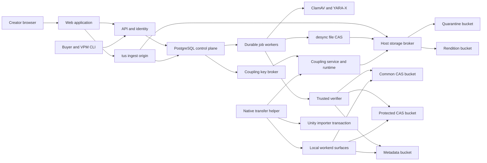

# Package storage and delivery implementation plan

Date: 2026-07-22
Status: implementation plan ready for review
Architecture: [package-storage-delivery-architecture.md](./package-storage-delivery-architecture.md)
Progress record: [package-storage-delivery-progress.md](./package-storage-delivery-progress.md)
Research record: [package-storage-research-ledger.md](./package-storage-research-ledger.md)

## 1. Purpose

This plan converts the target architecture into local implementation work.

The final test must prove the complete product path.

The test must do these actions:

1. Sign in as a creator.
2. Upload two related package versions.
3. Verify the durable storage location.
4. Verify cross-version chunk reuse.
5. Verify an entitled download.
6. Compare all reconstructed bytes with the source bytes.
7. Materialize one protected asset with forensic coupling.
8. Verify the signed materialization receipt.
9. Import the package into a clean Unity project.
10. Verify the committed Unity project state.

The final test must use real local components. Test doubles are not permitted in this lifecycle test.

## 2. Completion condition

The program is complete when all local gates pass on a clean machine state.

The final local command must return a nonzero exit code after any failed assertion.

The evidence report must identify each physical object and each logical file.

The provider acceptance profile must also pass before a production release.

The provider profile can run from a local machine. It uses disposable real provider resources.

Lossless delivery applies to the canonical logical file tree.

It does not require byte-identical reproduction of the outer archive container.

Opaque SPP files remain byte-identical.

Common logical files remain byte-identical.

Protected outputs change intentionally and must match their signed receipts.

## 3. Governing sources

Apply these sources in this order:

1. Security and data-integrity requirements in the repository instructions.
2. Explicit user requirements and target architecture decisions.
3. Current official specifications for external contract facts.
4. This implementation plan.
5. The Ponytail implementation rules for open implementation choices.

The progress record is nonnormative.

It records work state and cannot change a requirement.

Use [ASD-STE100 Issue 9](https://www.asd-ste100.org/assets/files/ASD-STE100_ISSUE9.pdf) for program documentation.

Use [Conventional Commits 1.0.0](https://www.conventionalcommits.org/en/v1.0.0/) for commit messages.

Use the repository branch naming rules for branch names.

Use the current official API reference before each external API change.

Record the reference URL in the plan or in a code comment.

Verify the response shape after each external API implementation.

## 4. Documentation rules

Apply these rules to new or changed program documentation:

- Use active voice.
- Use one topic in each paragraph.
- Use one instruction in each procedural sentence.
- Use the imperative form in procedures.
- Keep procedural sentences at 20 words or fewer.
- Keep descriptive sentences at 25 words or fewer.
- Use vertical lists for complex information.
- Do not use contractions.
- Do not use semicolons.
- Do not use em dashes.
- Define each uncommon technical term.
- Use the same term for the same object.
- Put conditions before instructions.
- Put warnings before the related action.

The mechanical documentation check must detect these items:

- em dashes
- semicolons in prose
- common English contractions
- procedural sentences longer than 20 words
- descriptive sentences longer than 25 words

The check cannot certify ASD-STE100 compliance.

A human reviewer must check all applicable Issue 9 rules.

The review includes vocabulary, verbs, voice, noun clusters, warnings, tables, and punctuation.

Apply this gate to these package-program files:

- `docs/package-storage-delivery-architecture.md`
- `docs/package-storage-delivery-implementation-plan.md`
- `docs/package-storage-delivery-progress.md`
- `docs/package-storage-research-ledger.md`
- future Markdown under `docs/package-storage-delivery/`

Do not infer the scope from all changed Markdown files.

## 5. Commit language

Use this program-specific subject format:

```text
<type>(<scope>): <imperative description>
```

Use these types:

- `feat` for a new product capability
- `fix` for a defect correction
- `test` for test coverage
- `docs` for documentation only
- `refactor` for an internal structure change
- `perf` for measured performance work
- `chore` for maintenance
- `build` for build changes
- `ci` for pipeline changes
- `revert` for an explicit Git revert

Use these primary scopes:

- `storage`
- `catalog`
- `ingest`
- `delivery`
- `auth`
- `importer`
- `coupling`
- `e2e`
- `docs`

Write the subject in the imperative form.

This profile requires a scope.

The base Conventional Commits specification permits an optional scope.

Keep one logical change in each Git commit.

Explain the reason in the commit body when the reason is not clear.

Record the test commands in the commit body.

Use `Tests: not run (documentation only)` when no runnable test applies.

Use a `BREAKING CHANGE:` footer for an incompatible contract change.

Use the smallest owning scope for a change that crosses internal areas.

Do not combine scope names.

Use `revert(<scope>): <imperative description>` for a revert.

Add `This reverts commit <sha>.` to its body.

Subject examples:

```text
feat(ingest): reserve upload capacity
feat(storage): publish file-oriented recipes
feat(importer): commit verified project changes
test(e2e): prove cross-version chunk reuse
docs(storage): record the provider acceptance gate
```

## 6. Ponytail implementation rules

Trace the full path before an implementation decision.

Use the first applicable item in this list:

1. Do not build an unnecessary component.
2. Reuse an existing repository component.
3. Use the standard library.
4. Use a native platform feature.
5. Use an installed dependency.
6. Use one clear statement.
7. Write the minimum correct code.

Do not simplify trust-boundary validation.

Do not simplify data-loss protection.

Do not simplify security controls.

Do not create a second owner for existing logic.

Fix the shared root cause after an inspection of all callers.

Leave the smallest fail-on-break check for each non-trivial logic change.

Use a `ponytail:` comment for each deliberate implementation ceiling.

State the ceiling and the upgrade trigger in that comment.

## 7. Terms

| Term                   | Meaning                                                                            |
| ---------------------- | ---------------------------------------------------------------------------------- |
| CAS                    | A content-addressed store. A digest identifies each stored byte sequence.          |
| CDC                    | Content-defined chunking. Content selects chunk boundaries.                        |
| API                    | An application programming interface. It defines communication between components. |
| B2                     | Backblaze B2 Cloud Storage. It is the durable bulk-byte store.                     |
| CBOR                   | Concise Binary Object Representation. It is the canonical metadata encoding.       |
| CDN                    | A content delivery network. Cloudflare supplies the launch CDN.                    |
| COSE                   | CBOR Object Signing and Encryption. It carries metadata signatures.                |
| HMAC                   | A keyed hash message authentication code. The v1 path uses it for capabilities.    |
| IPC                    | Interprocess communication. Unity uses local IPC to control the helper.            |
| JSON                   | JavaScript Object Notation. It is used for local request and result files.         |
| JWS                    | JSON Web Signature. It carries signed grant claims.                                |
| MinIO                  | The local S3-compatible object store used by tests.                                |
| SBOM                   | A software bill of materials. It lists artifact components.                        |
| SPP                    | A Substance 3D Painter project file. The launch system treats it as opaque.        |
| S3                     | An object-storage API. MinIO and B2 provide compatible subsets.                    |
| Common domain          | A deduplication domain for unprotected bytes.                                      |
| Protected domain       | A creator-scoped deduplication domain for protected source bytes.                  |
| Candidate              | An untrusted object that waits for independent verification.                       |
| Recipe                 | Ordered metadata that reconstructs one logical file from chunks.                   |
| Release                | An immutable published product version.                                            |
| Release selection      | The catalog pointer from a product version to one logical release.                 |
| Delivery binding       | A signed map from one release to exact storage versions for one region and epoch.  |
| Active binding pointer | The selected delivery binding for one release and region.                          |
| Grant                  | A short-lived authorization for one release and one device key.                    |
| Install session        | A short-lived signed instruction for one alias, release, buyer, and device.        |
| Coupling               | Server-side personalization that binds protected output to a buyer and release.    |
| Receipt                | Signed evidence for one materialization result.                                    |
| Exact version          | One provider object version with a provider version identifier.                    |
| Fence                  | A lease generation that rejects work from an obsolete worker.                      |
| DPoP                   | A proof that the request sender holds the device private key.                      |
| TUF                    | The Update Framework. It secures helper update metadata.                           |
| VPM                    | The VRChat Package Manager. VCC uses it to install public packages.                |
| VCC                    | The VRChat Creator Companion. It invokes VPM for project packages.                 |
| tus                    | A protocol for resumable HTTP uploads.                                             |
| Git commit             | One recorded source-control change.                                                |
| Project commit         | The atomic application of verified files to a Unity project.                       |
| Database commit        | The durable completion of one database transaction.                                |
| Work session           | One bounded implementation period with a recorded handoff.                         |
| Lifecycle test         | The final creator-to-Unity acceptance test.                                        |

The requested bit-level deduplication means byte-exact chunk reuse.

The system does not deduplicate individual changed bits.

## 8. Scope

### 8.1 Required scope

Build these capabilities:

- creator sign-in and product ownership checks
- resumable creator upload
- durable raw quarantine
- malware and policy scanning
- safe logical archive normalization
- per-file content-defined chunks
- common and protected deduplication domains
- exact-version storage inventory
- trusted verification and promotion
- signed immutable release metadata
- provider-neutral entitlement verification
- proof-of-possession delivery grants
- resumable importer transfer
- machine-wide common chunk cache
- transactional Unity project changes
- protected materialization
- signed materialization receipts
- correlated analytics and audit events
- durable backpressure
- epoch-fenced garbage collection
- local lifecycle acceptance
- real-provider acceptance

### 8.2 Deferred scope

Do not implement these items for launch:

- automatic horizontal scaling
- ingest failover
- cross-region storage replication
- automatic region failover
- custom chunk packing
- macOS coupling implementation

Keep provider, domain, location, and protocol fields extensible.

Fail closed on an unsupported operating system.

Do not emulate an unsupported platform path.

## 9. Current baseline

The repository already contains useful storage foundations.

Reuse these foundations before new code is added.

| Area          | Current state                                                            | Required change                                                |
| ------------- | ------------------------------------------------------------------------ | -------------------------------------------------------------- |
| Creator UI    | Uploads supported package extensions with `tus-js-client`.               | Preserve the UI and connect it to durable asynchronous state.  |
| Upload API    | Checks session, ownership, billing, and upload capability.               | Add durable admission, reservation, and queue status.          |
| tus origin    | Accepts resumable 5 GiB uploads.                                         | Quarantine raw bytes before processing.                        |
| Catalog       | Uses PostgreSQL transactions, outbox events, retries, and `SKIP LOCKED`. | Add the full v2 state machine, fences, jobs, and reservations. |
| Canonicalizer | Canonicalizes the complete outer archive.                                | Produce a safe logical file tree before chunking.              |
| CAS           | Uses real `desync` with local or S3 storage.                             | Use per-file recipes and separate domains.                     |
| Promotion     | Reconstructs and hashes one candidate.                                   | Verify untrusted output in a separate trusted step.            |
| Delivery      | Reconstructs a JSON manifest behind an HMAC URL.                         | Add signed bindings, membership, grants, and DPoP.             |
| Import proof  | Reconstructs bytes with `desync`.                                        | Move transfer and cache work into the native helper.           |
| Buyer test    | Proves entitlement and byte-exact download.                              | Add creator UI, deduplication, coupling, VPM, and Unity.       |
| GC            | Uses key-based mark and sweep.                                           | Use exact versions, reachability closure, pins, and epochs.    |
| Scheduler     | Uses a process-local timer.                                              | Use durable jobs, fenced leases, and resource tokens.          |
| Importer      | Installs a complete archive synchronously.                               | Add resume, receipt checks, and transactional project changes. |
| Coupling      | Returns materialized paths from a Windows shim.                          | Return and verify a signed `MaterializationReceiptV2`.         |

The present buyer test is an important base.

It already proves PostgreSQL, MinIO, Convex, API, entitlement, and byte equality.

Extend its reusable harness instead of creating a separate fake system.

## 10. Repository ownership

The program changes four local repositories.

| Repository       | Path                                                                           | Ownership                                                                         |
| ---------------- | ------------------------------------------------------------------------------ | --------------------------------------------------------------------------------- |
| CreatorAssistant | `E:\GitDevelopment\Development\CreatorAssistant`                               | Web, API, catalog, ingest, storage, delivery, tests, and the central records.     |
| Transfer helper  | `E:\GitDevelopment\Development\CreatorAssistant\Verify\Native\transfer-helper` | Planned Go helper, TUF client, DPoP key, transfer cache, and tree reconstruction. |
| Coupling service | `E:\GitDevelopment\Development\ca-coupling`                                    | Proprietary Linux materialization service and native runtime.                     |
| Unity components | `E:\Unity\Components\YUCP-Components`                                          | VPM package, importer, Unity tests, and release gates.                            |

Keep this plan and the progress record in CreatorAssistant.

Record the commit identifier from each repository in each evidence report.

Inspect all four worktrees before each session.

Do not overwrite unrelated local changes.

Use a scoped branch or worktree before implementation work begins.

Do not perform GitHub operations without explicit approval.

## 11. Local test profiles

### 11.1 Local lifecycle profile

Run this profile without paid cloud operations.

Use these real local components:

- PostgreSQL 17 in a disposable container
- MinIO in a disposable container
- five private MinIO buckets
- local Convex real-test backend
- CreatorAssistant API
- CreatorAssistant web application
- tus ingest origin
- durable scheduler and workers
- ClamAV scanner
- YARA-X policy scanner
- `desync` v1.0.3
- local `workerd` through Wrangler
- separate local Worker processes
- coupling service
- native coupling runtime
- VPM command-line tool
- Unity 2022.3 Editor
- OpenTelemetry collector or HyperDX local stack
- Chromium with a virtual passkey authenticator

Cloudflare documents that `wrangler dev` uses Miniflare and `workerd`.

Use [Cloudflare local development](https://developers.cloudflare.com/workers/local-development/) as the runtime reference.

Use local service bindings for communication between Worker surfaces.

### 11.2 Provider acceptance profile

Run this profile from a local machine against disposable provider resources.

Use a nonproduction Backblaze B2 account or bucket set.

Use a nonproduction Cloudflare account and routes.

Use one supported store-provider sandbox or dedicated test product.

Prove these provider behaviors:

- B2 Native API copy by source file identifier
- exact file version inventory
- Object Lock retention behavior
- multipart cancellation and reconciliation
- deletion by exact file identifier
- Worker cache-key isolation
- CDN cache reuse
- Tiered Cache behavior
- Worker request and subrequest counts
- least-privilege application keys
- creator connection and product mapping
- buyer verification and scheduled reconciliation
- refund, dispute, expiry, and outage-evidence behavior

Use [Backblaze `b2_copy_file`](https://www.backblaze.com/apidocs/b2-copy-file) for the copy contract.

Do not claim provider behavior from MinIO or `workerd` results.

### 11.3 Large-file profile

Keep the 5 GiB profile manual and opt-in.

Run it after the normal lifecycle profile passes.

Use generated deterministic bytes.

Do not store the fixture in Git.

Verify upload resume, expansion limits, disk reservation, and cleanup.

## 12. Required local topology



The local bucket roles must match the production credential boundaries.

Use configuration for bucket names.

Do not put durable package bytes in Convex.

## 13. Storage placement

Create five versioned local buckets for the lifecycle profile.

| Bucket role   | Required local content                                              | Forbidden content                                  |
| ------------- | ------------------------------------------------------------------- | -------------------------------------------------- |
| Quarantine    | Raw uploads and untrusted candidate chunks or metadata.             | Published release bindings.                        |
| Common CAS    | Verified common chunks.                                             | Protected source chunks and personalized outputs.  |
| Protected CAS | Verified creator-scoped protected chunks.                           | Common chunks and personalized outputs.            |
| Metadata      | Signed descriptors, file tables, membership, and delivery bindings. | Raw archives, receipts, and package payload bytes. |
| Renditions    | Temporary personalized outputs and browser renditions.              | Master keys and permanent source chunks.           |

Use the v2 key names from the architecture document.

Enable versioning on each local bucket.

Enable Object Lock when the common, protected, and metadata buckets are created.

Use the launch governance-retention policy in local acceptance.

Record the provider version identifier after each write.

Use exact-version reads for verification and promotion.

Skip a chunk write when a verified object already exists in the same domain.

Do not infer physical reuse from a matching object key.

Prove that the second upload creates no extra version for each reused chunk.

## 14. Backpressure and cost controls

Use PostgreSQL as the durable queue.

Do not add a queue product at launch.

Reserve these resources before upload admission:

- compressed upload bytes
- expected expanded bytes
- scratch bytes
- worker slots
- scanner slots
- materialization slots
- outbound transfer budget
- quarantine byte-hours
- worst-case new canonical bytes
- immutable metadata and Object Lock retention bytes
- verifier source operations
- verifier input bytes
- personalized rendition byte-hours
- durable shared-rendition cache bytes
- B2 recovery headroom

Run one large local job at a time.

Permit small overlay jobs only after a resource test passes.

Reject or queue work before the creator transfers bytes when capacity is unavailable.

Return the queue reason and an estimated retry time.

Use weighted lanes for these job classes:

- ingest
- verification
- delivery repair
- protected materialization
- garbage collection

Reserve one small lane for repair and control work.

Do not let a large ingest starve grant revocation or repair work.

Use fixed worker counts in the local and launch profiles.

Increase node capacity only after a recorded scaling trigger.

Track these scaling signals:

- queue age
- upload rejection rate
- scratch-disk pressure
- worker saturation
- scanner duration
- publication duration
- materialization duration
- delivery origin requests
- monthly storage growth

Treat Worker delivery budgets as soft forecasts at launch.

Do not describe a local rate limit as an exact global cost limit.

Benchmark and approve the exact `D_data` and `D_verifier` fixed-price SKUs.

The local profile must not use paid storage or paid delivery.

The normal CI profile must use small deterministic fixtures.

The provider profile must clean all disposable objects after evidence capture.

## 15. Security and integrity invariants

The following invariants are release blockers:

- Authenticate before a storage read.
- Validate authorization before membership disclosure.
- Separate common and protected namespaces.
- Bind each grant to one release and one device key.
- Reject an expired grant.
- Reject an expired install plan.
- Reject a replay outside the allowed window.
- Verify each chunk digest before cache insertion.
- Verify each recipe before reconstruction.
- Verify each reconstructed file digest.
- Verify the release root before project mutation.
- Verify the receipt before protected project mutation.
- Keep signing keys outside untrusted workers.
- Keep master coupling keys outside clients.
- Do not log credentials or grant values.
- Reject archive path traversal.
- Reject reparse-point or symbolic-link escapes.
- Enforce entry, expansion, ratio, chunk, and path limits.
- Preserve preexisting project files after any failed install.
- Publish a binding only after durable read-back verification.
- Delete objects only through an epoch-fenced journal.

Propagate the trace context across every process boundary.

Emit aggregate chunk metrics instead of one full trace per chunk.

## 16. Work breakdown

P1 can proceed in parallel when a P0 risk test needs local infrastructure.

Do not start P2 or irreversible format work before P0-10 passes.

After P0-10, complete P2 through P11 in order.

Update the progress record after each work session.

### Phase P0: Freeze evidence and contracts

#### P0-00: Add the documentation gate

Add `bun run docs:ste` with the existing Bun runtime.

Use no new package for the mechanical checks.

Check the program Markdown files from Section 4.

Compare work item identifiers in this plan and the progress board.

Report a file, line, rule, and suggested review action.

Do not claim full ASD-STE100 certification.

Exit gate:

- The current program documents pass the mechanical checks.
- The plan and progress board contain the same work item identifiers.
- A human review records all applicable Issue 9 checks.

#### P0-01: Record the executable baseline

Actions:

1. Record all three worktree states.
2. Record installed tool versions.
3. Run the existing storage tests.
4. Run the existing buyer delivery test.
5. Run the current importer compilation.
6. Save command results in the progress record.

Exit gate:

- The record distinguishes product failures from environment failures.
- The record identifies every preexisting failure.

#### P0-02: Ratify the chunk profile

Actions:

1. Build a representative multi-version corpus.
2. Include Unity packages, ZIP files, and SPP files.
3. Measure `desync` profiles on logical files.
4. Measure physical bytes and object counts.
5. Ratify or change the `64:256:1024 KiB` profile.

Prove exact reuse for 1, 4, 16, 32, and 64 KiB files.

Cover renamed paths, reordered archives, products, and versions.

Exit gate:

- The decision includes corpus digests and repeatable commands.
- The decision states the object-count and byte-cost tradeoff.

#### P0-03: Freeze signed contracts

Actions:

1. Define deterministic CBOR schemas.
2. Define COSE signing purposes.
3. Define release, grant, binding, receipt, and install-session versions.
4. Create TypeScript golden vectors.
5. Add the importer Editor test assembly.
6. Add C# golden-vector checks to that assembly.
7. Create native golden-vector checks where the runtime parses data.

Define `InstallSessionV2` with these claims:

- strict token type, algorithm, issuer, audience, and key identifier
- creator, buyer, product, version, and alias identity
- release root, binding root, and device-key thumbprint
- allowed API and artifact origins
- exact bootstrap locations and digests
- issue time, not-before time, expiry, and maximum lifetime
- one stable session identifier

Validate the session when Unity resolves the plan.

Validate the session again before project mutation.

Reject `alias-install-plan-v1`.

Keep one current server-authorized alias contract.

Define `FileTableIndexV2` as the signed discovery map for file-table shards.

Map normalized path ranges to exact shard digests.

Keep ordered chunk recipes inside `FileTableShardV2`.

Do not create a second recipe object format.

Define a bounded membership index with the same discovery property.

Exit gate:

- All languages produce the same digests.
- Each parser rejects noncanonical encodings.
- Each purpose rejects a signature from another purpose.
- Expired, misplaced, and origin-swapped install sessions fail.

#### P0-04: Prove provider semantics

Actions:

1. Use disposable B2 buckets.
2. Test copy by exact source identifier.
3. Test version-specific download and deletion.
4. Test Object Lock behavior.
5. Measure native and S3 API differences.
6. Record cleanup evidence.

Exit gate:

- The storage port exposes every required exact-version operation.
- The plan contains no unverified provider assumption.

#### P0-05: Prove fixed-node capacity and cost

Measure the complete provisional disk budget on the proposed `D_data` node.

Prove bounded normalization at the maximum compressed and expanded limits.

Compare file-oriented `desync` with Longtail on the same corpus.

Measure verifier reads, bytes, hashing, CPU, RAM, disk, and queue age.

Inventory every invoice line for the proposed production profile.

Include compute, storage, operations, egress, backup, support, secrets, observability, taxes, add-ons, and renewal prices.

Separate fixed charges, included allowances, metered charges, and hard provider caps.

Exit gate:

- The 5 GiB compressed and 20 GiB expanded limits fit the approved disk budget.
- The selected CDC engine wins the recorded acceptance matrix.
- The control node stays below 70 percent of each reserved capacity dimension.
- The fixed monthly floor includes taxes, add-ons, and renewal prices.

#### P0-06: Prove the Cloudflare delivery path

Run the primary cache path on a real Cloudflare account.

Test from at least three supported regions.

Measure Worker requests, CPU time, subrequests, cache results, and origin bytes.

Test cache poisoning, exact-version rebinding, grant replay, and grant churn.

Trigger each configured usage and spend alert with a bounded acceptance account.

Measure alert delay and compare the alert value with provider billing data.

Run the internal-only Workers Cache fallback if one primary invariant fails.

Exit gate:

- One accepted chunk request causes the expected billed work.
- Buyer data never enters the common cache key.
- Invalid authorization causes no cached-byte response.
- One approved edge design passes security and billing gates.
- Each alert names the measured resource and has an accepted error bound.

#### P0-07: Prove upload and rendition limits

Run a 5 GiB tus upload through the real Cloudflare proxy.

Keep each patch at 64 MiB or less.

Authenticate each tus method at the origin.

Stream a maximum browser rendition through B2 multipart upload.

Verify the exact rendition version before a grant is issued.

Measure quarantine and rendition byte-hours.

Exit gate:

- Upload restart behavior passes before and after durable quarantine.
- Multipart reconciliation leaves no unknown write.
- Private range delivery passes its amplification limits.
- Creator and global byte-hour ceilings stop excess work before creation.

#### P0-08: Prove helper and coupling trust

Pin a test TUF root in the importer.

Verify one headless helper update, rollback, and freeze rejection.

Reconstruct one complete package with the helper.

Materialize one PNG with the master outside the codec sandbox.

Verify one signed receipt after trusted exact-version readback.

Prove per-file subkeys and attribution lookup through the Linux materialization service.

Test the public VPM alias trigger on Windows x64.

Run install, update, repair, rollback, and uninstall on each launch-supported target.

Exit gate:

- The helper accepts only trusted update metadata and publisher identity.
- The codec receives no storage or signing credential.
- The receipt binds the verified rendition version.
- Per-file key reuse does not occur across protected files.
- Attribution identifies the expected pseudonymous test subject.
- Unsupported platforms fail before protected mutation.
- Each launch-supported target completes the project lifecycle.

#### P0-09: Prove provider and telemetry boundaries

Run one real store-provider plugin through its supported live-smoke profile.

Prove creator connection, product mapping, buyer verification, and reconciliation.

Prove refund, dispute, credential expiry, and provider-outage evidence lifetime.

Flood bounded invalid requests and scanner failures.

Measure trace, log, and metric cardinality.

Exit gate:

- Shared code contains no provider branch.
- The provider response contracts match current cited documentation.
- Credential values and buyer data do not enter logs.
- Observability write volume remains within the approved cap.

#### P0-10: Approve the format freeze

Review all P0 evidence and security residuals.

Approve or reject the data-host substitution risk.

Approve deterministic metadata, storage names, and helper trust roots.

Freeze the Better Auth protected-resource identifier and schema migration boundary.

Use the official [Better Auth 1.7 upgrade guide](https://better-auth.com/docs/guides/1-7-upgrade-guide).

Do not approve a format with an open trust or cost assumption.

Complete one gate matrix for all architecture Phase 0 requirements.

Name the evidence path, owner, result, and residual risk for each requirement.

Exit gate:

- P0-00 through P0-09 are done.
- The security owner accepts the recorded launch residuals.
- The product owner accepts the fixed cost and capacity envelope.
- Irreversible schemas and object formats can begin.
- The matrix covers small files, bounded normalization, supported targets, Linux coupling, invoices, and alerts.
- The matrix records the Better Auth resource and DPoP migration decision.

### Phase P1: Build the local harness

#### P1-01: Extract shared service harnesses

Reuse the current PostgreSQL, MinIO, and Convex test helpers.

Create one composable lifecycle harness.

Keep each test responsible for its disposable resources.

Exit gate:

- One failure causes deterministic process and container cleanup.
- Parallel test runs use isolated ports, buckets, and database names.

#### P1-02: Add the local storage profile

Actions:

1. Start PostgreSQL 17.
2. Start MinIO.
3. Create five versioned buckets.
4. Enable Object Lock on common, protected, and metadata buckets.
5. Create least-privilege local credentials.
6. Start the Convex real-test backend.
7. Run all schema migrations.

Exit gate:

- A credential cannot read or write an unrelated bucket role.
- Restarting the harness preserves no prior test data.

#### P1-03: Add the local process supervisor

Start only real program processes.

Start the API, web app, tus origin, workers, scanners, and coupling services.

Start separate Worker surfaces through local Wrangler processes.

Wait for explicit health and readiness checks.

Exit gate:

- The supervisor reports the failed component and its log path.
- The supervisor does not hide a missing executable.

#### P1-04: Add deterministic local identities

Use the supported manual provider plugin for local store verification.

Use a real Better Auth passkey flow for creator and buyer sessions.

Use a Chromium virtual authenticator for the local test.

Keep the buyer browser session separate from the native broker session.

Add one supported broker identity-bootstrap entry point.

Make the broker start the production PKCE and loopback flow.

Write its one-time authorization URL to a restricted result file.

Keep the PKCE verifier and OAuth tokens inside the native broker.

Use the signed-in buyer Playwright context to open the authorization URL.

Complete the loopback callback before any lifecycle operation starts.

Persist the refresh credential through operating-system secure storage.

Delete the authorization result file after the callback completes.

Require a new sign-in when the broker replaces the Unity token owner.

Do not migrate the former Unity refresh credential.

Exit gate:

- The final test signs in through the browser UI.
- The final test does not inject a browser session cookie.
- The native broker completes a real authorization-code exchange.
- The lifecycle request contains no browser cookie, OAuth code, verifier, or token.
- Batch lifecycle work can refresh the broker session without a browser.
- Unity cannot read the access token, refresh token, or DPoP private key.

#### P1-05: Create the clean Unity project fixture

Track a text-only project template at `ops/fixtures/package-lifecycle/unity-project-template`.

Pin Unity `2022.3.22f1` and revision `887be4894c44`.

Keep only the required manifest, project settings, assets marker, and test settings.

Add `bun run fixture:unity-project -- --run-root <absolute-run-root>`.

Make the command create `<absolute-run-root>/unity-project` from the template.

Reject a run root outside the lifecycle test directory.

Reset the runtime project before each lifecycle run.

Pass the same absolute project path to VPM CLI and every Unity process.

Keep `Library`, `Logs`, `Temp`, and generated package locks outside the template.

Exit gate:

- The reset command produces the same tracked-file digest twice.
- Unity opens the copied project with the pinned Editor version.
- VPM and Unity report the same normalized project path.
- No test mutates `E:\Unity\Components\YUCP-Components`.

### Phase P2: Extend the durable control plane

#### P2-01: Add the v2 PostgreSQL model

Add tables for these records:

- uploads
- durable jobs
- lease generations
- resource reservations
- storage write intents
- exact object versions
- recipes
- releases
- release selections
- delivery-binding versions
- active delivery-binding pointers
- install sessions
- delivery grants and expiry
- stable abuse sessions
- protection-policy snapshots
- active-content inventories
- pins
- deletion epochs
- deletion journal entries
- materialization jobs
- materialization receipts
- rendition jobs and multipart parts
- attribution records
- replication policies
- storage regions, locations, and epochs

Add the model without deleting the v1 read path.

Exit gate:

- Migrations run forward on existing development data.
- Every state transition uses one database transaction.
- Every external effect starts from a durable intent.

#### P2-02: Implement fenced leases

Use `FOR UPDATE SKIP LOCKED` for job claims.

Increment the lease generation on each new claim.

Require the generation for every state mutation.

Reject output from an obsolete generation.

Exit gate:

- A killed worker can resume without duplicate publication.
- A stale worker cannot publish after lease loss.

#### P2-03: Implement admission and reservations

Calculate resource demand before upload authorization.

Create durable reservations with expiry.

Return visible backpressure when a reservation is unavailable.

Exit gate:

- The service never overcommits configured scratch capacity.
- Repair work remains available during a large ingest.

#### P2-04: Implement durable scheduling and reconciliation

Claim jobs through weighted durable lanes.

Apply creator fairness and an aging floor.

Reserve a maintenance lane for repair and control work.

Heartbeat each active lease.

Move exhausted retries to a reviewable dead-letter state.

Estimate queue start time from declared work and measured history.

Reconcile each uncertain storage write before a retry.

Adopt only one exact version that matches the complete write intent.

Exit gate:

- A process restart loses no queued job.
- One creator cannot starve another creator.
- A stale worker cannot write after lease loss.
- A lost provider response does not create an unrecorded object.
- Zero or multiple matching versions fail closed and cause an alert.

### Phase P3: Implement exact-version storage

#### P3-01: Define the storage port

Model these required operations:

- begin a write intent
- put an immutable object
- find a verified digest in one domain
- read one exact version
- copy one exact source version
- inspect retention metadata
- list exact versions
- delete one exact version
- start one multipart upload
- upload one exact part
- list uploaded parts
- complete one multipart upload
- reconcile one uncertain multipart operation
- cancel an unfinished multipart upload

Do not expose provider response objects outside the adapter.

Exit gate:

- MinIO and B2 adapters pass the same contract suite.
- The suite includes race and retry cases.

#### P3-02: Implement local MinIO storage

Use installed S3 support where it satisfies the port.

Store provider-version metadata in PostgreSQL.

Use write intents for every mutating operation.

Exit gate:

- A retry does not create an unrecorded duplicate version.
- Read-back verification uses the recorded exact version.

#### P3-03: Implement native B2 operations

Use the B2 Native API for exact-version operations.

Keep general S3 operations behind the same storage port.

Exit gate:

- The provider acceptance profile passes P0-04 cases.
- Application keys have only required capabilities.

#### P3-04: Implement the host storage broker

Expose one bounded local IPC protocol to untrusted workers.

Require job, lease generation, operation, domain, digest, and length.

Derive each object key inside the broker.

Require a committed write intent before a provider call.

Use only fixed quarantine-write and rendition-write credentials.

Attach the exact returned provider version through a fenced database update.

Send uncertain responses to P2-04 reconciliation.

Do not expose list, arbitrary-key, canonical-write, canonical-delete, or key-administration operations.

Exit gate:

- A sandbox cannot select an object name or bucket.
- A stale lease cannot write or adopt an object.
- A missing write intent prevents the provider call.
- An uncertain write becomes one recorded version or a closed integrity incident.
- A broker credential cannot read or delete canonical content.

### Phase P4: Implement durable ingest and publication

#### P4-01: Make upload completion durable

Change tus completion to finalize the raw digest.

Write the raw object to quarantine.

Record the exact object version.

Enqueue the scan job.

Return without synchronous normalization.

Exit gate:

- A process crash after tus completion loses no accepted bytes.
- The creator sees a durable queued state.

#### P4-02: Add bounded scanning

Run ClamAV and YARA-X in the untrusted processing boundary.

Apply time, CPU, memory, file, and output limits.

Record scanner versions and rule digests.

Exit gate:

- Scanner failure blocks publication.
- Scanner output cannot change the trusted catalog directly.

#### P4-03: Normalize a logical file tree

Use libarchive for ZIP and tar containers.

Parse Unity package GUID groups explicitly.

Treat SPP as an opaque logical file.

Apply all architecture expansion and path limits.

Reject duplicate and case-colliding paths.

Load one versioned creator protection-policy snapshot.

Classify normalized paths after parsing.

Use generic path rules and materializer capability identifiers.

Reject a protected path without a supported verified materializer plugin.

Build the active-content inventory for scripts, assemblies, executables, and native plugins.

Exit gate:

- Archive order and timestamp changes do not change logical file identities.
- Malicious archive fixtures fail before trusted storage writes.
- Untrusted archive metadata cannot select a protection domain.
- Unsupported protected content blocks publication.
- The active-content inventory contains each executable-content path and digest.

#### P4-04: Produce file-oriented chunks

Use the chunk engine selected by P0-05.

Store a file below the selected minimum as one direct content-addressed chunk.

Run the selected CDC engine for each larger logical file.

Use the ratified CDC profile.

Put common bytes in the global common domain.

Put protected bytes in the creator-scoped protected domain.

Exit gate:

- Identical small files share one common object.
- Local edits reuse unchanged large-file chunks.
- Protected chunks never resolve through the common domain.

#### P4-05: Verify and promote candidates

Use a trusted verifier that does not parse the original archive.

Read each candidate by exact version.

Verify every digest and recipe.

Copy verified objects by exact source identifier.

Read the promoted versions back.

Exit gate:

- Corrupt candidate bytes cannot enter a published release.
- A lost retry cannot activate a partial release.

#### P4-06: Publish immutable metadata

Publish data in this order:

1. chunks
2. file-table shards with embedded recipes
3. file-table index
4. membership shards and index
5. release descriptor
6. delivery-binding shards and index

Sign each required root with its purpose.

Commit the active-content inventory digest and policy version in the release descriptor.

Give each metadata object its own committed write intent.

Stage each object in quarantine.

Promote each object by exact source identifier.

Read each promoted exact version again.

Verify digest, signature, retention, and exact location.

Keep each object pinned through publication acknowledgement.

Verify one pending-release sample through the production HTTP path.

Record the release, delivery binding, pins, and `PUBLICATION_PENDING` in one fenced database transaction.

Append the complete catalog projection to the transactional outbox.

Wait for the Convex projection acknowledgement.

Activate the product release selection and active delivery-binding pointer in one fenced database transaction.

Mark the job `PUBLISHED`.

Exit gate:

- Readers see the old release or the complete new release.
- Readers never see a partial release.
- A failed Convex projection cannot activate a release.
- A repaired storage version can replace a delivery binding without changing the logical release root.

### Phase P5: Implement authorized delivery

#### P5-01: Split Worker surfaces

Create separate deployments for these surfaces:

- metadata and common content
- quarantine content
- protected source content
- renditions

Use separate credentials for each surface.

Use generated Wrangler environment types.

Keep request state inside the request handler.

Exit gate:

- Each Worker fails a cross-surface credential test.
- All Worker tests run in `workerd` locally.

#### P5-02: Resolve bindings and grants

Resolve the active binding through the API.

Verify entitlement through the provider-neutral plugin contract.

Issue a short-lived release grant.

Bind the grant to the device public key.

Mint grants through a typed signing RPC.

Persist `grant_jti` before token issue.

Apply evidence lifetime, refund, dispute, and revocation policy at issue and renewal.

Use typed service grants for quarantine, protected-source, verification, and rendition routes.

Exit gate:

- An unentitled user receives no membership data.
- A grant for one release cannot read another release.
- A revoked entitlement receives no renewed grant.
- Convex and edge services receive no general signing key.

#### P5-03: Add DPoP and membership checks

Require proof of possession on each authenticated buyer and service route.

Migrate token verification from `verifyBearerToken` to request-bound `verifyAccessTokenRequest`.

Cover common, metadata, quarantine, protected-source, and rendition routes.

Validate method, canonical URL, issue time, nonce, and proof identifier.

Validate strict JWS type, algorithm, issuer, audience, key, lifetime, and clock skew.

Bind `ath` to the exact presented grant.

Keep stable `grant_jti` separate from per-proof `dpop_jti`.

Reject observed same-instance proof reuse through a bounded local cache.

Use this cache only as an abuse signal.

Do not claim exact cross-region replay prevention without exact edge state.

If P0-06 requires exact prevention, add and price the approved edge-state design.

Reuse one stable abuse-session identifier during renewal.

Apply cooldown and quota when a client creates another session.

Check chunk membership before the origin read.

Exit gate:

- A copied bearer value fails without the device key.
- An invalid membership request causes no storage read.
- Token substitution fails.
- Same-instance proof reuse and proof-identifier rotation fail.
- Multi-region replay matches the residual or exact-state decision from P0-06.
- Grant churn cannot bypass the admitted session budget.

#### P5-04: Stream verified delivery

Buffer at most one bounded encoded chunk.

Limit the encoded chunk to the architecture maximum.

Verify the chunk before the client response.

Verify chunk bytes before local cache commit.

Support bounded range and retry behavior.

Use stable buyer-independent cache keys for common chunks.

Keep helper-cache verification separate from Cloudflare cache behavior.

Use the primary CDN path only after P0-06 passes.

Use the approved internal Workers Cache fallback after a primary-path failure.

Exit gate:

- A multi-chunk download survives an injected connection loss.
- A corrupted origin object fails before reconstruction completes.
- The Worker never buffers a complete package.
- A failed edge gate cannot be bypassed by configuration.

### Phase P6: Build the native transfer and VPM path

#### P6-01: Define the helper protocol

Put a versioned IPC contract behind the importer services.

Use `Verify/Native/transfer-helper` as the helper workspace.

Build one native Go executable for each supported platform.

Let Unity request these high-level operations:

- sign in
- sign out
- preflight
- install
- update
- repair
- rollback
- recover
- uninstall
- cancel

Include the alias, project identity, roots, approval binding, idempotency key, and trace context.

Use length-bounded local IPC.

Authenticate each IPC peer.

Require an exact user-authorized operation capability.

Bind the capability to the device, project, operation, release, approval, trace, and expiry.

Consume the capability once through PostgreSQL.

Return the durable result for an exact idempotent retry.

Reject a retry that changes any bound value.

Return only typed progress, verified staging handles, receipts, and terminal results.

Do not return a token, private key, capability, session, or grant to Unity.

Do not put a credential in an argument, environment variable, request file, result file, or log.

Exit gate:

- An unsupported helper version fails closed.
- Unity can resume a transfer after an Editor restart.
- A malformed or oversized IPC message fails before state mutation.
- A Unity script cannot decrypt or request an OAuth credential.
- A replayed capability creates no second external effect.
- A restart returns the original idempotent result.

#### P6-02: Implement the helper transfer engine

Give the helper ownership of these functions:

- TUF update verification
- OAuth authorization code flow
- OAuth refresh and revocation
- device key storage
- DPoP signatures
- operation capability exchange
- install session and delivery grant handling
- release metadata verification
- chunk download
- common chunk cache
- recipe reconstruction
- complete tree verification

Use operating-system credential storage.

Keep the buyer OAuth session inside the native broker.

Give the broker only short-lived DPoP-bound grants.

Do not persist a grant.

Use `go-tuf/v2` for helper update verification.

Pin the initial TUF root in the reviewed importer package.

Define offline root and targets roles.

Define online timestamp and snapshot roles.

Use threshold signing, expiry, and consistent snapshots.

Verify rollback and freeze protection.

Verify the expected operating-system publisher identity.

Install updates atomically.

Roll back a failed helper update.

Produce a signed artifact, SBOM, provenance record, and reproducible-build comparison.

Use one machine-wide common chunk cache.

Version the cache layout and set a hard byte quota.

Use digest-based eviction with recency data.

Use a cross-process single-flight lock for each chunk.

Keep partial downloads outside the verified cache.

Commit a cache entry with an atomic rename after digest verification.

Remove abandoned partial downloads after a bounded lifetime.

Exit gate:

- The helper never returns an unverified staging tree.
- A cache hit still passes digest verification.
- Two projects reuse one verified cached chunk safely.
- Concurrent downloads create one committed cache entry.
- A corrupt cache entry is removed and downloaded again.
- A failed update restores the last trusted helper.
- Rollback, freeze, threshold, and publisher tests pass.
- A clean machine can install the signed helper from the pinned root.

#### P6-03: Keep VPM as a bootstrap

Preserve the current `alias-v1` discovery seam.

Implement the signed `InstallSessionV2` contract from P0-03.

Enforce expiry, clock skew, origin, locator, alias, device, and release bindings.

Keep no `alias-install-plan-v1` adapter.

Publish the generic importer as a public VPM package.

Publish one small public `alias-v1` package for each product.

Make the alias package depend on the generic importer.

Keep paid product bytes outside both public packages.

Use the official [VPM CLI](https://vcc.docs.vrchat.com/vpm/cli/) in tests.

Exit gate:

- `vpm add repo` adds the local repository.
- `vpm add package` installs the product alias into a clean project.
- VPM dependency resolution installs the generic importer.
- The registered-package event starts the production entitlement flow.
- VPM does not expose a paid package artifact URL.

#### P6-04: Replace Unity credential ownership

Evict the legacy 30-day license-token cache after migration.

Delete the Unity OAuth token owner.

Delete every EditorPrefs and DPAPI token path.

Do not migrate any former Unity refresh credential.

Move sign-in, refresh, revocation, and DPoP behind one native broker.

Let the broker open the authorization URL with the operating-system browser.

Let the lifecycle harness open the same URL with its signed-in Playwright context.

Keep one PKCE generator, callback validator, token exchange, refresh path, and secure store.

Store supported long-lived credentials with operating-system protection.

Require a new user sign-in after the cutover.

Detect broker and runtime capabilities before protected work.

Fail closed on an unsupported operating system.

Exit gate:

- No persisted file contains a grant or legacy license token.
- Unity contains no access token, refresh token, or DPoP private key.
- Unity cannot call the broker-only grant exchange.
- Unsupported systems do not start Windows executables.
- Unsupported systems do not call PowerShell, `regsvr32`, or DPAPI.
- Unsupported systems do not mutate protected project paths.

### Phase P7: Make Unity installation transactional

#### P7-01: Add a supported headless entry point

Add `YUCP.Importer.Editor.Batch.PackageLifecycleEntry.Run` as the batch entry point.

Pass request and result file paths through dedicated environment variables.

Keep credentials and grants out of the request file.

Version the request and result JSON schemas.

Define these request operations:

- `preflight`
- `install`
- `update`
- `repair`
- `rollback`
- `uninstall`
- `recover`

Include these request fields:

- `schemaVersion`
- `runId`
- `operation`
- `projectPath`
- `productAlias`
- `idempotencyKey`
- `expectedCurrentReleaseRoot`
- `targetReleaseRoot`
- `approvedActiveContentDigest`
- `approvedPolicyVersion`

Require only the fields that apply to the selected operation.

Validate `projectPath` against the project that Unity opened.

Make `preflight` return the signed active-content inventory digest and policy version.

Bind execution approval to both returned values.

Reject a stale approval when either value changes.

Do not let `preflight` change the project.

Include these result fields:

- `schemaVersion`
- `runId`
- `operation`
- `status`
- `exitCode`
- `traceId`
- `projectPath`
- `productAlias`
- `currentReleaseRoot`
- `targetReleaseRoot`
- `activeContentDigest`
- `policyVersion`
- `receiptReferences`
- `journalId`
- `journalState`
- `errorCode`
- `errorMessage`

Write the result to a temporary sibling file.

Flush the file and rename it atomically.

Run one Unity process for each requested operation.

Keep asynchronous work alive with an `EditorApplication.update` coordinator.

Unregister all callbacks at terminal completion.

Call `EditorApplication.Exit(code)` exactly once after the result commit.

Do not use Unity `-quit` for a lifecycle operation.

Define deterministic exit codes for success, cancellation, validation, transfer, coupling, and project failures.

Write one structured terminal result before Unity exits.

Suppress interactive `InitializeOnLoad` behavior in batch mode.

Prevent the Harmony import interceptor from opening an Editor window in batch mode.

Do not bypass production verification logic.

Exit gate:

- The command returns a structured terminal result.
- A dialog cannot silently decline a batch install.
- No batch initializer opens a browser, dialog, network request, or Editor window.
- Cancellation returns a stable result and leaves the project unchanged.
- Repeating one idempotency key returns the prior terminal outcome.
- A changed target or operation cannot reuse an idempotency key.
- A missing terminal result means the journal needs recovery.
- A stale active-content approval fails before transfer or mutation.

#### P7-02: Extend the importer test assembly

Use the Editor test assembly from P0-03.

Use the existing Unity Test Framework package.

Run tests with Unity batch mode.

Exit gate:

- Importer tests appear in the Unity XML result.
- The Unity process returns a nonzero code after failure.

#### P7-03: Implement a project transaction

Acquire one project-wide importer lock.

Reject concurrent package events while the lock is held.

Create a staging tree outside the live project paths.

Validate all final paths against the project root.

Reject reparse points and symbolic-link escapes.

Record pre-state hashes and backups.

Commit files atomically where the platform permits.

Use a durable transaction journal.

Emit one durable progress event after each flushed journal checkpoint.

Expose a test-only pause after a selected checkpoint.

Compile the pause controller only into the importer test assembly.

Pass its control path through `YUCP_IMPORT_TEST_CONTROL_PATH`.

Keep the test control file outside the lifecycle request schema.

Reject a pause request outside the deterministic lifecycle fixture.

Recover or roll back after an interrupted commit.

Include these records in the transaction:

- content paths
- `Packages/vpm-manifest.json`
- `Assets/YUCP/PackageRegistry.asset`
- `.yucp-dvi/Importer/InstallState`
- generated media
- ownership records
- receipt references
- Asset Database refresh state
- Unity Package Manager resolve state

Exit gate:

- A forced failure restores all overwritten files.
- No unexpected file remains after rollback.
- Modified user files remain protected during uninstall.
- Two simultaneous installers cannot mutate one project.
- A failed Package Manager resolve restores the prior manifest and registry.
- A new Unity process can recover each interrupted checkpoint.

#### P7-04: Remove retired importer paths

Audit the public download bridge and catalog-header path.

Remove each unused ABI.

Treat the custom signed Unity package verifier as migration-only.

Do not fall back from COSE or TUF verification silently.

Reject retired registry and install-state schemas.

For the current local extractor, enforce these limits:

- expanded bytes
- entry count
- expansion ratio
- duplicate and case-colliding paths
- tar checksum and entry type
- symbolic-link and reparse-point escape
- final project-root containment

Verify each declared `fileHashes` value.

Reject a manifest with a missing, incomplete, or mismatched hash list.

Exit gate:

- No retired caller or protocol remains.
- The new trust path has one authoritative verifier.
- Retired local state fails closed with reinstall guidance.
- Importer archive attacks fail before live project mutation.

### Phase P8: Implement protected materialization

#### P8-00: Implement the coupling key broker

Keep the coupling master only in the trusted control plane.

Keep all coupling implementation code in `E:\GitDevelopment\Development\ca-coupling`.

Keep only provider-neutral contracts and broker clients in CreatorAssistant.

Run the coupling service only on Linux servers.

Do not add a Windows coupling server or client-side coupling path.

Accept one signed and proof-of-possession job capability.

Check the current job and lease generation.

Consume the one-use capability in one database transaction.

Derive one subject, release, epoch, plugin, and output-scoped seed.

Send the seed through an inherited pipe or anonymous memory.

Never use an environment variable, command argument, file, response body, or log.

Wipe active seed memory after the codec exits.

Exit gate:

- A replayed or stale capability returns no seed.
- The codec process receives no master or storage credential.
- Crash artifacts, command lines, files, and logs contain no seed.
- Per-file subkeys differ for different file digests and paths.

#### P8-01: Issue a materialization grant

Verify entitlement before job creation.

Bind the grant to buyer, release, device, job, and lease identifiers.

Enforce a short maximum lifetime.

Exit gate:

- Expired and replayed grants fail.
- The client never receives a master or derivation key.

#### P8-02: Materialize a protected fixture

Use a supported protected PNG fixture first.

Run the real local coupling service and native runtime.

Send attribution work in bounded sequential batches.

Send only assets that have stored attribution candidates.

Use a 24 MiB maximum request body at launch.

Return one newest candidate for each deterministic attribution identifier.

Run the codec without a storage, signing, or master credential.

Return output hashes and the tree root to the host broker.

Write personalized output through a fenced broker intent.

Read the exact rendition version through the trusted verifier.

Verify its digest, length, entries, and output tree.

Exit gate:

- The output differs for two buyer subjects.
- Each output still decodes through the supported runtime path.
- The codec cannot write storage or sign a receipt.
- Host-to-storage byte substitution fails before receipt creation.

#### P8-03: Sign and verify the receipt

Version the coupling-service, helper, and Unity receipt transport.

Return `MaterializationReceiptV2` only after trusted readback.

Include these fields:

- release root
- protected source root
- output tree root
- output file hashes
- buyer subject pseudonym and pseudonym method
- grant identifier
- job identifier
- lease generation
- exact rendition provider version and file identifier
- materialization algorithm and plugin versions
- codec build
- key epoch
- helper build
- runtime build
- created paths
- creation and expiry times

Verify the signature before any Unity project mutation.

Persist the signed server receipt after verified materialization.

Persist its Unity project-ledger reference only after project commit.

Exit gate:

- A changed receipt field fails verification.
- The attribution record identifies the installed output exactly.
- A protocol version mismatch fails closed at each receipt boundary.

#### P8-04: Build browser renditions

Reserve shared-cache bytes or personalized rendition byte-hours before work.

Construct ZIP output through fenced multipart upload.

Record each part and reconcile an uncertain completion.

Read the exact completed version through the trusted verifier.

Verify whole-object digest, archive limits, entry hashes, and tree root.

Issue a private range grant only after verification.

Keep personalized renditions for the configured short lifetime.

Apply a bounded successful-use policy to shared renditions.

Exit gate:

- A partial multipart upload cannot become downloadable.
- Multi-range and amplification requests fail.
- A retained shared rendition remains inside its global byte ceiling.
- Expired personalized output is deleted by exact version.

### Phase P9: Complete lifecycle operations

#### P9-01: Implement update and repair

Use the same verified project transaction for update and repair.

Reuse cached common chunks after digest verification.

Preserve user-modified files according to the ownership policy.

Exit gate:

- Update from version one to version two reuses shared chunks.
- Repair restores damaged owned files without changing unrelated files.

#### P9-02: Implement rollback and uninstall

Use the ownership ledger and transaction journal.

Restore prior files after rollback.

Remove only unchanged owned files during uninstall.

Exit gate:

- Rollback restores the prior verified release.
- Uninstall reports each preserved modified file.

#### P9-03: Implement exact-version garbage collection

Compute reachability from these roots:

- published and publication-pending releases
- active grants and their old delivery bindings
- active bindings and release selections
- upload, promotion, materialization, and rendition jobs
- storage write intents
- rollback roots
- legal holds
- recently retired roots
- explicit pins

Traverse the complete signed metadata closure.

Use an epoch fence before deletion.

Require two completed collection generations.

Apply the longest grant, rollback, retention, and job grace.

Write each deletion to a durable journal.

Delete by exact provider version identifier.

Exit gate:

- Shared chunks survive release removal.
- Protected outputs expire without deleting source chunks.
- A concurrent publication cannot lose a reachable object.
- An active old grant keeps its exact old binding reachable.
- A legal hold prevents exact-version deletion.
- Post-GC reconstruction passes through the production HTTP path.

#### P9-04: Implement namespace retention

Keep successful quarantine versions for 24 hours after verified publication.

Keep failed, rejected, cancelled, uncertain, or orphaned quarantine versions for seven days.

Keep importer overlays for 24 hours by default.

Keep personalized ZIP renditions for seven days by default.

Keep shared ZIP renditions for 30 days after the latest retention event.

Use creation, release retirement, or successful delivery as retention events.

Accept one idempotent successful-delivery confirmation for each browser session.

Do not extend retention from grant issue or range requests.

Use a 24-to-72-hour lifecycle backstop for unfinished multipart uploads.

Apply explicit receipt, attribution, privacy-erasure, and legal-hold policies.

Make logical unpublication immediate even when Object Lock delays physical deletion.

Exit gate:

- Each namespace follows its configured state transition and exact deletion time.
- Repeated ranges cannot keep a shared rendition alive.
- Privacy erasure removes the authorized identity mapping after its required retention.
- Lifecycle rules cannot delete a reachable canonical object.

### Phase P10: Prove the full lifecycle

Run the measured Windows client flow inside one pre-provisioned Hyper-V virtual machine.

Use a licensed Windows image and the pinned Unity Editor.

Pin the virtual machine UUID, checkpoint UUID, name, generation, switch, and ownership marker.

Require the virtual machine to be off before the run.

Probe and revalidate every pinned identity before mutation.

Restore the clean checkpoint before and after the run.

Use PowerShell Direct only as the authenticated transport.

Run browser, VPM, broker, and Unity work through a typed guest agent.

Contain each guest process tree in a kill-on-close Windows Job Object.

Send no credential through an argument, environment variable, log, or evidence file.

Bind the signed evidence to the request digest, root trace, and observed network policy.

Do not use the host Unity, VCC profile, browser profile, or user credential store.

Exit gate:

- A read-only probe passes before the virtual machine starts.
- The guest proves process-tree containment and zero surviving children.
- The host receives one atomic purpose-signed evidence report.
- A failed cleanup makes the lifecycle fail.
- The final checkpoint restore passes.

#### P10-01: Add the browser creator path

Use Playwright for the creator session and upload flow.

Register a passkey through the real authentication endpoint.

Sign out before the measured flow.

Sign in through the visible browser UI.

Upload version one and version two through the visible creator UI.

Exit gate:

- The test does not call the upload API directly.
- The UI shows durable status through publication.

#### P10-02: Add physical storage assertions

Query PostgreSQL through a read-only test connection.

Inventory all five buckets by exact object version.

Compare the inventory with the signed release closure.

Exit gate:

- Every reachable physical object has one catalog record.
- Every catalog object resolves to the required bucket and key.
- Convex contains no package payload bytes.

#### P10-03: Add the buyer and Unity path

Sign in as the buyer through the visible browser UI.

Redeem a real manual-provider license.

Reset the pinned Unity project fixture.

Install the version-one public alias with VPM CLI.

Use the same absolute project path for VPM and Unity.

Complete the broker PKCE bootstrap with the signed-in buyer browser.

Run `preflight` before each install or executable-content change.

Approve the exact returned inventory digest and policy version.

Run the importer through the Unity batch entry point.

Verify the active-content disclosure before executable content changes.

Update the same project to version two.

Corrupt one owned file and run repair.

Roll back to version one.

Modify one tracked user file.

Uninstall the product.

Verify preservation of the modified user file.

Inject one interrupted project commit and verify recovery.

Verify and snapshot receipts after install, update, and rollback.

Verify retained attribution evidence after uninstall.

Exit gate:

- The importer downloads through local Worker surfaces.
- Unity commits the complete expected project tree.
- The protected PNG has a valid signed receipt.
- Update reuses the expected common chunks.
- Repair, rollback, uninstall, and interrupted recovery pass.
- Active executable content cannot change without disclosure.
- The browser session never enters Unity through injection.
- Unity receives no broker credential or delivery authorization.
- Each lifecycle transition runs in a separate Unity process.

#### P10-04: Produce the evidence report

Write a machine-readable JSON report.

Write a short ASD-STE100 summary from that report.

Attach process logs and Unity XML results by path.

Exit gate:

- One report proves every completion condition in Section 2.
- The report contains no credential value.

### Phase P11: Add production gates

#### P11-01: Run provider acceptance

Run the provider profile after the local lifecycle passes.

Collect exact B2 identifiers and Cloudflare request evidence.

Run the selected real store-provider acceptance profile.

Prove connection, mapping, verification, reconciliation, refund, dispute, expiry, and outage behavior.

Clean all non-retained disposable resources immediately.

Record each retention-locked version in a cleanup ledger.

Schedule exact deletion after retention expiry.

Exit gate:

- Non-retained test namespaces have an empty inventory.
- Each retained version has an exact identifier and scheduled deletion time.
- Cost and request counts stay within approved bounds.

#### P11-02: Add release gates

Gate CreatorAssistant releases on applicable repository checks.

Gate importer releases and VPM listings on Unity compilation and EditMode tests.

Gate helper releases on TUF, update, signing, SBOM, provenance, and clean-machine tests.

Gate coupling releases on native runtime and receipt-contract tests.

Keep the 5 GiB test manual.

Exit gate:

- A failed importer test prevents a package release.
- A failed storage test prevents a storage deployment.
- A failed supply-chain check prevents a helper or runtime release.

#### P11-03: Add operations runbooks

Document these operations:

- queue drain
- failed job retry
- stale lease recovery
- object reconciliation
- key rotation
- release revocation
- receipt investigation
- restore test
- garbage collection recovery
- capacity increase

Exit gate:

- Each runbook includes a safe stop condition.
- Each destructive action identifies its exact target first.

#### P11-04: Provision production boundaries

Create production buckets with versioning, Object Lock, and lifecycle policies.

Create exact least-privilege keys for each Worker, promoter, broker, reconciler, monitor, and janitor.

Protect the tus origin with Cloudflare Tunnel or authenticated origin restrictions.

Run archive and codec jobs in rootless sandboxes.

Apply OS identities, read-only images, resource limits, and network restrictions.

Add a verified scanner-definition update path.

Provision the backup target, secret boundaries, key broker, and signing services.

Generate and review SBOM and provenance data for each deployed artifact.

Set B2 daily monetary caps with 75 percent and 100 percent alerts.

Set Cloudflare budget alerts as delayed notifications.

Reserve existing account-wide Worker allowance before delivery admission.

Add projected month-end spend dashboards.

Label fixed-node limits and B2 caps as hard controls.

Label stateless Worker delivery budgets as soft forecasts.

Exit gate:

- A credential matrix test proves each denied cross-boundary action.
- The data node cannot sign, delete canonical data, or read a master key.
- A sandbox cannot reach B2 or another job workspace.
- Restore, key rotation, and data-node isolation drills pass.
- Spend alerts fire before a hard B2 cap stops required recovery work.
- Operators can distinguish each hard control from each soft forecast.

#### P11-05: Cut over from storage v1 to v2

Select one internal canary product.

Publish the same source through v1 and v2.

Compare logical roots, installed trees, entitlements, and delivery evidence.

Keep the v1 release and rollback roots reachable during the canary.

Migrate additional products in bounded batches.

Stop each batch after an integrity, cost, or latency regression.

Load-test v2 before it becomes the default writer.

Keep the v1 reader until all rollback windows expire.

Retire the v1 writer and reader through separate reviewed changes.

Exit gate:

- The canary has equal logical content and successful Unity lifecycle results.
- Each migration batch has a complete rollback record.
- Production load stays inside the approved capacity and cost envelope.
- No active release, grant, or rollback root depends on the retired v1 path.

## 17. Final lifecycle fixture

Create one deterministic product with two versions.

Keep the normal fixture small enough for routine local runs.

### Version one

Include these files:

- `package.json`
- one small repeated shader
- one small repeated metadata file
- one large deterministic binary file
- one common PNG
- one protected PNG
- one inert Editor script
- one file that exists only in version one

### Version two

Keep the shader and metadata file unchanged.

Change one local region in the large binary file.

Keep the common PNG unchanged.

Keep the protected source PNG unchanged.

Change the inert Editor script.

Remove the version-one-only file.

Add one version-two-only file.

Store expected SHA-256 values outside the generated archives.

Store expected logical roots outside the generated archives.

Generate equivalent Unity package and ZIP fixtures where practical.

Use SPP as a separate opaque-file contract test.

## 18. Final lifecycle test procedure

The target command is `bun run test:package-lifecycle:local`.

This command does not exist at the plan date.

Implement it in Phase P10.

Run these steps:

1. Verify required executable versions.
2. Create one isolated test directory.
3. Reset `<run-root>/unity-project` from the tracked template.
4. Verify the pinned Unity project version.
5. Start PostgreSQL and MinIO.
6. Create five versioned buckets.
7. Enable required local Object Lock policies.
8. Start the local Convex backend.
9. Start the API and web application.
10. Start tus and durable workers.
11. Start scanners and the trusted verifier.
12. Start all local Worker surfaces.
13. Start the coupling service and native runtime.
14. Start correlated trace collection.
15. Create creator and buyer identities.
16. Register creator and buyer passkeys.
17. Create one creator product.
18. Connect the supported manual store provider.
19. Create one buyer license.
20. Sign out both browser contexts.
21. Sign in as the creator through the UI.
22. Upload version one through the UI.
23. Wait for the published state.
24. Capture the version-one storage inventory.
25. Sign in as the buyer through the UI.
26. Redeem the manual-provider license.
27. Add the local VPM repository.
28. Install the version-one alias into `<run-root>/unity-project`.
29. Start the native broker identity-bootstrap operation.
30. Wait for its one-time authorization URL.
31. Open the URL in the signed-in buyer context.
32. Complete the PKCE loopback exchange.
33. Verify the broker reports a refreshable session.
34. Delete the authorization result file.
35. Run version-one `preflight` in a new Unity process.
36. Capture its signed inventory digest and policy version.
37. Approve those exact values.
38. Run version-one `install` in a new Unity process.
39. Verify common downloads used local Worker surfaces.
40. Verify the protected PNG materialization.
41. Verify the version-one project inventory.
42. Verify and snapshot the version-one receipt evidence.
43. Upload version two through the creator UI.
44. Wait for the published state.
45. Capture the version-two storage inventory.
46. Prove physical chunk reuse.
47. Run version-two `preflight` in a new Unity process.
48. Compare the active-content change disclosure.
49. Approve the returned digest and policy version.
50. Run version-two `update` in a new Unity process.
51. Verify the version-two project inventory.
52. Verify and snapshot the version-two receipt evidence.
53. Corrupt one owned common file.
54. Run `repair` in a new Unity process.
55. Verify the repaired file digest.
56. Run version-one `rollback` in a new Unity process.
57. Verify the version-one project inventory again.
58. Verify and snapshot the rollback receipt evidence.
59. Run version-two `update` in a new Unity process.
60. Verify and snapshot the second version-two receipt evidence.
61. Corrupt one owned common file again.
62. Select the pause after the repair staging checkpoint.
63. Start `repair` in a new Unity process.
64. Wait for the durable staging-checkpoint event.
65. Terminate that Unity process while it is paused.
66. Run `recover` in a new Unity process.
67. Verify the recovered version-two project inventory.
68. Modify one tracked user file.
69. Run `uninstall` in a new Unity process.
70. Verify preservation of the modified user file.
71. Verify removal of all other owned files.
72. Verify retained server receipts and attribution evidence.
73. Run the importer EditMode tests.
74. Verify all common source and reconstructed hashes.
75. Verify all saved protected-output hashes against saved receipts.
76. Verify no unexpected project file exists.
77. Verify correlated traces for the complete flow.
78. Write the evidence report.
79. Stop all processes.
80. Remove disposable containers and test data.

## 19. Required lifecycle assertions

### 19.1 Creator sign-in

Assert these facts:

- The creator used the visible sign-in surface.
- Better Auth completed the passkey ceremony.
- The browser received no injected session value.
- The upload capability belongs to the creator and product.

### 19.2 Buyer identity and project fixture

Assert these facts:

- The buyer used the visible sign-in and redemption surfaces.
- The native broker used authorization code with PKCE.
- The loopback callback returned to the native broker.
- The browser session was not copied into Unity.
- Unity received no OAuth token, refresh credential, DPoP key, capability, session, or grant.
- The refresh credential used operating-system secure storage.
- The batch lifecycle entry opened no browser.
- VPM and Unity used `<run-root>/unity-project`.
- The runtime project started from the pinned text-only template.
- The source Unity-components project remained unchanged.

### 19.3 Storage location

Assert these facts:

- The raw upload exists only in quarantine before publication.
- Common chunks exist only in the common bucket after promotion.
- Protected chunks exist only in the protected bucket after promotion.
- Signed release metadata exists only in the metadata bucket.
- Personalized bytes exist only in the rendition bucket.
- PostgreSQL records each exact object version.
- Convex stores identity and product state, not payload bytes.

### 19.4 Deduplication

Assert these facts:

- The identical shader has one recipe identity.
- The identical shader chunks have one physical version per common key.
- The identical common PNG does not create new physical chunk versions.
- Unchanged regions of the large file reuse chunk identifiers.
- Changed regions create only the required new chunks.
- Protected chunks do not reuse common-domain objects.
- Logical bytes exceed new physical bytes by the measured reuse amount.

Compute these values:

```text
reusedLogicalBytesV2 = v2 recipe bytes resolved to canonical versions created before v2
newCanonicalLogicalBytesV2 = logical bytes in canonical versions first created for v2
newCanonicalEncodedBytesV2 = encoded bytes in canonical versions first created for v2
deduplicationRatio = all recipe logical reference bytes / unique canonical logical chunk bytes
compressionRatio = unique canonical logical chunk bytes / unique canonical encoded bytes
```

Exclude quarantine, metadata, and rendition bytes from the deduplication ratio.

Report their retained physical bytes separately.

The report must show exact object-version counts and byte counts.

### 19.5 Authorized download

Assert these facts:

- The buyer has a materialized entitlement.
- The grant identifies one release root.
- The DPoP proof matches the registered device key.
- The membership check runs before each common or protected origin read.
- Metadata, quarantine, protected-source, and rendition routes validate their typed grants.
- An unentitled control user receives HTTP 403.
- The unentitled request causes no storage read.

### 19.6 No data loss

Assert these facts:

- Each downloaded chunk matches its digest.
- Each reconstructed file matches its source SHA-256.
- The reconstructed logical tree matches the signed root.
- The Unity staging tree matches the reconstructed tree.
- The committed common files match the source bytes exactly.
- The protected output matches every receipt hash.
- The complete test preserves all expected file sizes and byte values.

### 19.7 Coupling

Assert these facts:

- The server performs protected materialization.
- The client receives no master key.
- The result binds buyer, release, device, job, and lease.
- The receipt signature is valid.
- The receipt identifies all created project paths.
- A second buyer receives a different personalized output.
- Both personalized outputs pass the supported runtime decode check.

### 19.8 Unity import

Assert these facts:

- VPM installs only the public bootstrap and importer.
- The importer uses the native helper protocol.
- Unity mutates no live path before verification.
- The transaction journal reaches the committed state.
- Asset Database refresh completes.
- Expected assets exist at expected project paths.
- Importer ownership records match committed paths.
- Receipt references match protected committed paths.
- Unity reports no import error.
- Each operation produced one atomic terminal result.
- Preflight changed no project path.
- Execution used approval for the exact active-content digest.
- The interrupted repair stopped after a durable checkpoint.
- A new Unity process completed recovery from that checkpoint.
- Saved receipt evidence survived product uninstall.

## 20. Required negative tests

Keep focused negative tests outside the long lifecycle test where possible.

The aggregate gate must include these cases:

- unauthenticated upload
- product ownership mismatch
- unavailable resource reservation
- interrupted tus upload
- raw digest mismatch
- scanner timeout
- scanner detection
- archive traversal
- duplicate archive path
- case-colliding path
- excessive archive expansion
- excessive file count
- stale worker fence
- corrupt candidate chunk
- partial promotion retry
- noncanonical CBOR
- wrong COSE purpose
- expired binding
- expired install plan
- expired grant
- broker OAuth state mismatch
- broker OAuth PKCE verifier mismatch
- missing broker refreshable session
- Unity credential extraction attempt
- broker IPC peer substitution
- operation capability replay
- operation capability context substitution
- operation authorization restart
- operation result idempotent retry
- same-instance DPoP replay
- wrong DPoP URL
- DPoP token substitution
- DPoP proof-identifier rotation
- grant churn and renewal abuse
- multi-region proof replay against the P0-06 decision
- chunk outside membership
- corrupt delivered chunk
- interrupted helper transfer
- cache corruption
- helper protocol mismatch
- TUF rollback and freeze metadata
- wrong operating-system publisher
- materialization grant replay
- receipt field modification
- receipt signature modification
- Unity project path escape
- Unity opened-project mismatch
- Unity reparse-point escape
- lifecycle idempotency-key conflict
- stale active-content approval
- partial lifecycle result file
- interrupted project commit
- modified user file during uninstall
- concurrent publication during garbage collection
- active old grant during garbage collection
- legal hold during garbage collection
- browser multipart completion uncertainty
- browser multi-range amplification
- active-content change without disclosure

Each test must prove the nearest durable invariant.

Do not test only the visible symptom.

## 21. Evidence report

Write one JSON report for each lifecycle run.

Include these fields:

```text
schemaVersion
runId
startedAt
completedAt
result
repositoryCommits
toolVersions
traceId
creatorId
buyerSubjectId
productId
versionIds
releaseRoots
fixtureDigests
unityProjectTemplateDigest
storageInventory
deduplicationMetrics
downloadComparisons
grantEvidence
unityIdentityEvidence
unityOperationResults
receiptSnapshots
attributionEvidence
unityTestResult
projectInventory
cleanupResult
```

Redact identities that are not deterministic test identities.

Do not include tokens, secrets, private keys, or credential values.

Keep failed-run evidence until the failure is understood.

## 22. Target command surface

Add the fewest commands that cover distinct profiles.

Target these commands:

| Command                                              | Purpose                                      |
| ---------------------------------------------------- | -------------------------------------------- |
| `bun run dev:storage`                                | Start the complete local storage topology.   |
| `bun run fixture:unity-project -- --run-root <path>` | Reset the pinned local Unity fixture.        |
| `bun run test:package-lifecycle:local`               | Run the routine local lifecycle test.        |
| `bun run test:package-lifecycle:providers`           | Run disposable B2 and Cloudflare acceptance. |
| `bun run test:package-lifecycle:5gb`                 | Run manual large-file acceptance.            |
| `bun run docs:ste`                                   | Run the mechanical documentation check.      |

Reuse current storage commands as focused component gates.

Do not rename them without a migration need.

Use this Unity command shape:

```powershell
& $env:YUCP_UNITY_EDITOR_PATH `
  -batchmode `
  -nographics `
  -projectPath E:\Unity\Components\YUCP-Components `
  -runTests `
  -testPlatform EditMode `
  -testResults <result-path> `
  -logFile - `
  -quit
```

Use this shape for the headless lifecycle action:

```powershell
$env:YUCP_IMPORT_REQUEST_PATH = '<request-path>'
$env:YUCP_IMPORT_RESULT_PATH = '<result-path>'
& $env:YUCP_UNITY_EDITOR_PATH `
  -batchmode `
  -nographics `
  -projectPath <run-root>\unity-project `
  -executeMethod YUCP.Importer.Editor.Batch.PackageLifecycleEntry.Run `
  -logFile -
```

Put only paths and nonsecret identifiers in the request file.

Resolve credentials through the supported identity and secure-storage owners.

Confirm the exact flags against the current [Unity command-line reference](https://docs.unity3d.com/Manual/EditorCommandLineArguments.html).

Do not place a credential in a command argument.

Use authenticated native IPC for the broker identity bootstrap.

The lifecycle agent sends only paths, nonsecret identifiers, and trace context.

The broker writes the authorization URL to the restricted event file.

The Playwright buyer context opens that URL.

The broker owns the PKCE verifier, callback, token exchange, and secure-store commit.

The broker writes an atomic terminal result.

Unity receives only the terminal identity state and display name.

## 23. Definition of done for each work item

Mark a work item as done only when all applicable statements are true.

- The root flow was inspected before the change.
- Existing code was reused where it remained correct.
- The implementation has no production stub.
- Trust boundaries validate all input.
- Failure cannot cause silent data loss.
- The nearest runnable check passes.
- Relevant negative checks pass.
- Trace context crosses each new boundary.
- Logs contain no credential values.
- Documentation follows Section 4.
- Commit text follows Section 5.
- The progress record contains commands and evidence.
- All applicable repository gates pass.

A failed mandatory gate prevents `DONE` status.

Record a blocked handoff when a failure is outside the active change.

Run these CreatorAssistant checks before each handoff:

```text
bun audit
bun run lint
bun run typecheck
bun run test:external-integrations
bun run test:ci
```

Run all changed storage suites.

Run Unity compilation and importer EditMode tests after importer changes.

Run native runtime tests after coupling changes.

## 24. Session protocol

Use this procedure at the start of each session:

1. Read the architecture document.
2. Read this implementation plan.
3. Read the progress record.
4. Inspect all relevant worktrees.
5. Confirm the current active work item.
6. Confirm its dependencies.
7. Record the session start.

Use this procedure during each session:

1. Keep one work item active.
2. Add a failing regression first for a defect.
3. Implement the smallest complete root change.
4. Run the nearest test.
5. Run the applicable phase gate.
6. Record decisions immediately.
7. Record blockers immediately.

Use this procedure before each handoff:

1. Update the work item status.
2. Record changed files by repository.
3. Record exact commands and results.
4. Record the last durable checkpoint.
5. Record the next action.
6. Record unresolved risks.
7. Leave unrelated generated files unchanged.
8. Record each unexpected worktree change.
9. Request direction before any unrelated revert.

Do not mark a task complete from code inspection alone.

## 25. Initial decisions

| ID    | Decision                                                  | Reason                                                             |
| ----- | --------------------------------------------------------- | ------------------------------------------------------------------ |
| D-001 | Use one local lifecycle profile and one provider profile. | Local tests cannot prove real CDN or B2 semantics.                 |
| D-002 | Use PostgreSQL for durable jobs.                          | The repository already owns the required transaction patterns.     |
| D-003 | Use fixed worker counts and backpressure.                 | The launch cost must remain predictable.                           |
| D-004 | Use five storage roles.                                   | Each role needs a distinct trust and credential boundary.          |
| D-005 | Use file-oriented `desync` as the comparison baseline.    | P0-05 can select Longtail only after it wins the same-corpus gate. |
| D-006 | Use the manual provider plugin locally.                   | It is a real supported provider-neutral verification path.         |
| D-007 | Use passkeys in browser tests.                            | The flow avoids an external identity provider dependency.          |
| D-008 | Use VPM CLI for bootstrap acceptance.                     | The CLI gives deterministic VCC-compatible automation.             |
| D-009 | Use the real Unity Editor for final import.               | A TypeScript importer cannot prove Unity project behavior.         |
| D-010 | Use a protected PNG as the first coupling fixture.        | The native runtime already supports PNG round trips.               |
| D-011 | Do not implement failover at launch.                      | The product decision accepts this residual risk.                   |
| D-012 | Do not add custom chunk packing at launch.                | Current evidence does not justify another storage format.          |

## 26. Open confirmations

Resolve these items before the related phase begins:

- Confirm the licensed Unity 2022.3 executable path.
- Pin the VPM CLI version used by the lifecycle harness.
- Confirm native compiler and runtime prerequisites.
- Confirm disposable B2 and Cloudflare account ownership.
- Ratify the representative corpus and CDC profile.
- Confirm the helper update signing root custody process.
- Confirm the supported Windows versions.
- Define the macOS failure message for launch.

These confirmations do not block P0-01 or P1 work.

## 27. Source references

- [Target architecture](./package-storage-delivery-architecture.md)
- [Research record](./package-storage-research-ledger.md)
- [ASD-STE100 official site](https://www.asd-ste100.org/)
- [ASD-STE100 Issue 9](https://www.asd-ste100.org/assets/files/ASD-STE100_ISSUE9.pdf)
- [Conventional Commits 1.0.0](https://www.conventionalcommits.org/en/v1.0.0/)
- [Cloudflare local development](https://developers.cloudflare.com/workers/local-development/)
- [Cloudflare service bindings](https://developers.cloudflare.com/workers/runtime-apis/bindings/service-bindings/)
- [Backblaze `b2_copy_file`](https://www.backblaze.com/apidocs/b2-copy-file)
- [VPM command-line tool](https://vcc.docs.vrchat.com/vpm/cli/)
- [Unity Editor command-line arguments](https://docs.unity3d.com/Manual/EditorCommandLineArguments.html)
